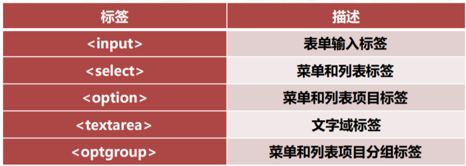
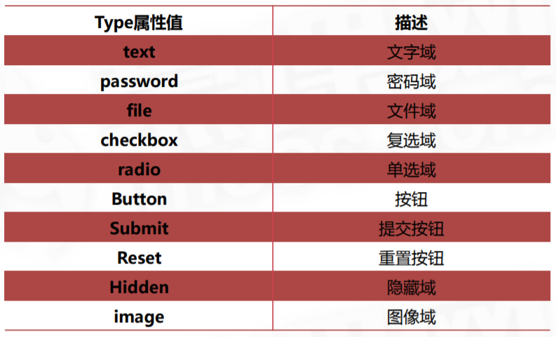
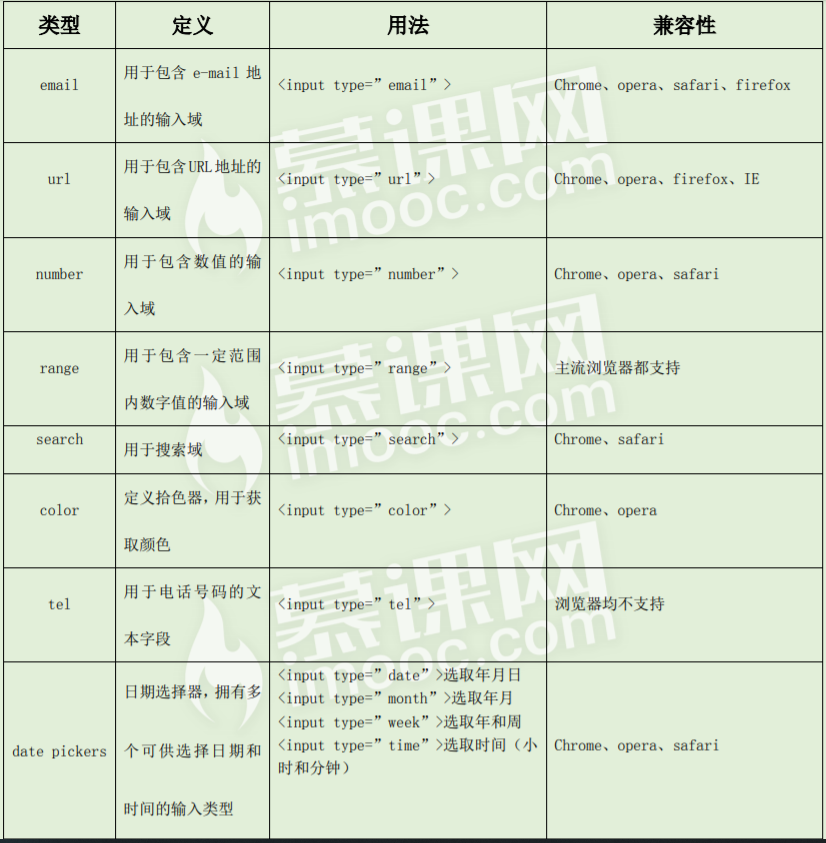
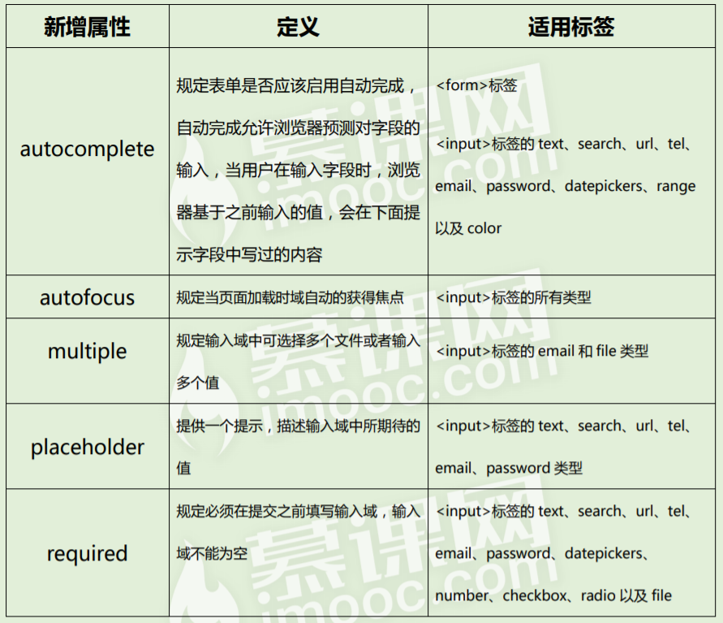
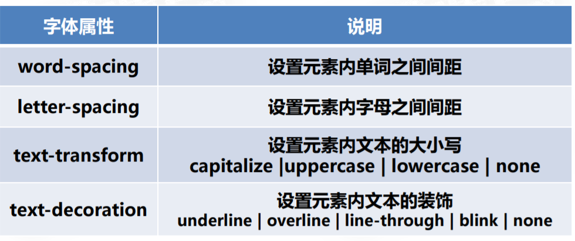
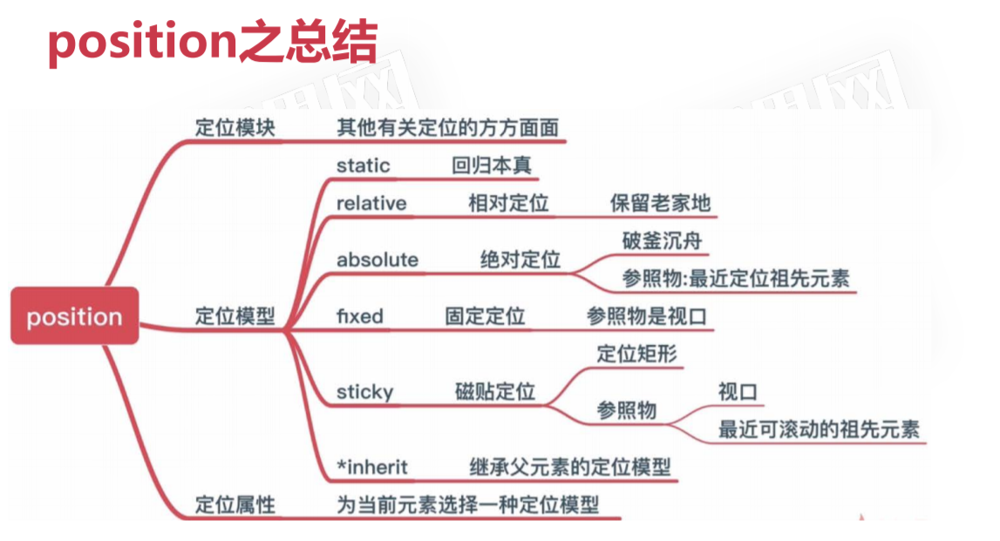
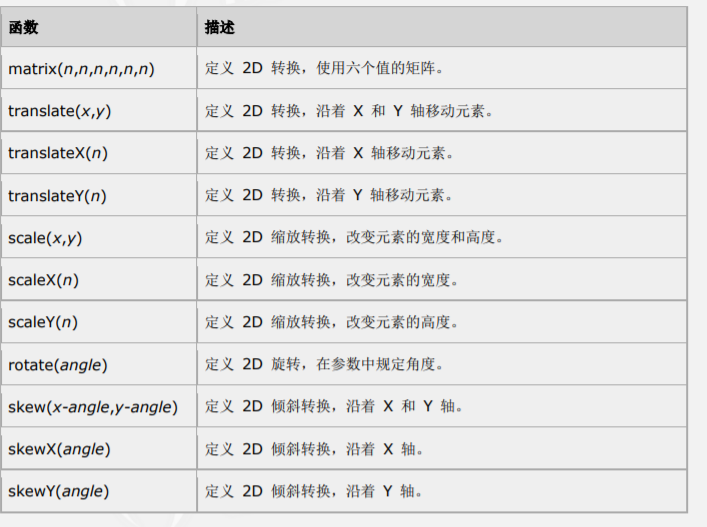
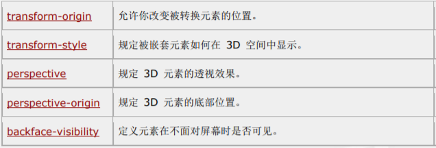
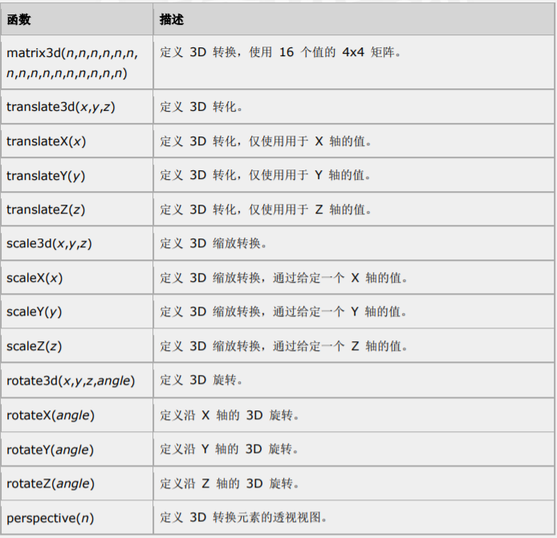
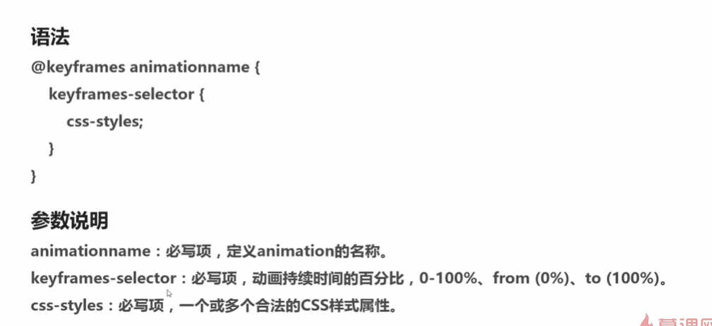

---

---

# HTML

## 1.HTML基础

### 1-1.什么是HTML

```
1. HTML(Hypertext Markup Language) 即超文本标记语言
2. HTML不需要编译，直接由浏览器执行
3. HTML是一个文本文件
4. HTML文件必须使用html或者htm为文件后缀
5. HTML大小写不敏感，HTML和html一样
```


### 1-2.DOCTYPE文档类型声明

```
<!DOCTYPE>声明必须放在HTML文档第一行
<!DOCTYPE>声明不是HTML标签
```

## 2.HTML表单





## 3.HTML行内元素和块级元素

行内元素

```
span, strong, en, br, img, input, label, select, a
```

块级元素

```
div, form, h1~h6, hr, ol, p, ul, table
```

行内和块元素的区别

1. 从显示效果来看
   - *块级元素*会独占一行，其宽度自动填满其父元素宽度
   - *行内元素*不会独占一行，相邻的行内元素会排列在同一行，直到一行排不下才会换行，其宽度随元素的内容而变化
2. 块级元素可以设置width，height属性，行内元素设置width，height无效
3. 块级元素可以设置margin和padding，行内元素元素的margin和padding只有水平方向生效，垂直方向设置无效


# HTML5

## 1.文档定义类型（DTD）

- DTD	
  - DTD可定义合法的XML文档构建模块，它使用一系列合法的元素来定义文档的结构。
- 在HTML中
  - DTD规定了标记语言的规则，这样浏览器才能正确的呈现内容。
- HTML5
  - HTML5不基于SGML，所以不需要引用DTD。
- HTML元素和文档类型
  - [查阅](http://www.w3school.com.cn/tags/html_ref_dtd.asp)

## 2.新增标签

### 2-1.结构标签（块级元素）--- 语义化的div

```html
<article>   标记定义一片文章
<header>    标记定义一个页面或区域的头部
<nav>		 标记定义导航链接
<section>	 标记定义一个区域
<aside>		 标记定义页面内容部分的侧边栏
<hgroup>	 标记定义文件中一个区块的相关信息
<figure>	 标记定义一组媒体内容以及它们的标题
<figcaption> 标记定义 figure 元素的标题
<footer>	 标记定义一个页面或区域的底部
<dialog>	 标记定义一个对话框（会话框）类似微信
```

### 2-2多媒体标签

1. *video*   标记定义一个视频
2. *audio*   标记定义音频内容
3. *source*    标记定义媒体资源
4. *canvas*    标记定义图片
5. *embed*    标记定义外部的可交互的内容或插件，比如flash

### 2-3.应用标签

1. *meter*     状态标签（实时状态） 兼容：C    F
2. *progress*   状态标签（任务过程）   兼容：   C     F    O  
3. *datalist*     为input标签定义一个下拉列表，配合option     兼容：   F      O
4. *details*     标记定义一个元素的详细内容，   配合summary    兼容：    C

## 3.新增input属性



## 4.form表单新增属性




# CSS

## 1.CSS选择器

1. *.class*  类选择器
2. *#id*    id选择器
3. *通配符选择器
4. *div*     标签选择器
5. *div，p*   群组选择器
6. *div  p*    后代选择器    选择div内部的所有p元素
7. *div > p*   子元素选择器    选择父元素为div的所有p元素
8. *div + p*   相邻兄弟选择器     选择紧接在div之后的所有p元素

## 2.文本样式属性




1. *text-shadow*    文本阴影
   1. 一共有 4 个值。第一个值为水平偏移量，第二 个值为竖直偏移量，第三个值为模糊距离，第四个值为颜色。text-shadow:10px 10px 10px red;
2. *word-break*  ：*normal*  |*break-all*  |*keep-all*    自动换行的处理方式
3. *word-wrap*   ：*normal* | *break-word*     允许长单词或URL地址换行到下一行
4. *text-overflow*   :  *clip* 剪切| *ellipsis* ...显示
5. *white-space : nowrap*    强制文本在一行内显示

## 3.盒子模型与边框

1. box-sizing 

   1. *content-box*     标准盒模型   默认值  元素的宽度=width+padding+border     高度=height+padding+border
   2. *border-box*     IE盒模型   元素宽度=width    高度=height

2.  盒阴影  box-shadow: *h-shadow v-shadow blur spread color* *inset*;

   1. | *h-shadow* | 必需的。水平阴影的位置。允许负值                             |
      | ---------- | ------------------------------------------------------------ |
      | *v-shadow* | 必需的。垂直阴影的位置。允许负值                             |
      | *blur*     | 可选。模糊距离                                               |
      | *spread*   | 可选。阴影的大小                                             |
      | *color*    | 可选。阴影的颜色。在[CSS颜色值](https://www.runoob.com/cssref/css_colors_legal.aspx)寻找颜色值的完整列表 |
      | *inset*    | 可选。从外层的阴影（开始时）改变阴影内侧阴影                 |

3. border-radius ：length | %


## 4.背景

1. *background-color*     设置元素背景颜色

2. *background-image*      设置元素背景图片

3. *background-repeat*      设置背景图片是否重复平铺

4. *background-attachment*    设置背景图像是否固定或随着页面滚动

   1.  *scroll*     默认值，背景图像随着页面滚动
   2.  *fixed*     当页面其余部分滚动时，背景图像不会移动

5. *background-position*   属性设置背景图像的位置

6. *background-clip*    指定背景图片绘制区域

   1. *border-box*     默认值   背景裁剪到边框
   2. *padding-box*     背景裁剪到内边距
   3. *content-box*     背景裁剪到内容

7. *background-origin*     设置元素背景图片的原始起始位置

8. *background-size*       指定背景图片大小。值可以为数值，百分比、cover、contain

   

## 5.浮动

- *元素浮动后具备inline-block（行内块元素）属性，   浮动元素脱离标准流*

- 清除浮动语法

  - *clear: none | left | right |both*

- 方法一：在浮动元素后使用一个空元素

  - ```css
    <div class="clear"></div>
    .clear {
    	clear:both;
    }
    ```

- 方法二：给浮动元素的容器添加*overflow：hidden* 

- 方法三：使用css3的*：after*伪元素

  - ```css
    .clearfix:after{
    	ccontent: "";
    	display: block;
    	height: 0;
    	visibility: hidden;
    	clear: both;
    }
    .clearfix { zoom: 1;兼容IE6,7 }
    ```

## 6.定位

### 6-1position的两个含义

1. Positioned Layout Module   提供与*元素定位*和*层叠相关*的功能   它是*核心模块*
2. *定位模型*
   1. *static*    静态定位   元素的默认值    常规流
   2. *relative*   相对定位  使元素成为可定位的祖先元素，相对自身在常规流中的位置进行偏移，*不脱标*，会保留原始位置
   3. *absolute*    绝对定位   *脱离常规流*，*尺寸百分比*为最近定位不是static的祖先元素，相对于最近定位不是static的祖先元素进行偏移。
   4. *fixed*    固定定位   相对于浏览器窗口进行偏移，不会随着视口滚动而滚动。
   5. *sticky*    磁贴定位   偏移标尺为最近有滚动的祖先元素，如果祖先元素中没有滚动，那么它的偏移标尺为视口，会保留常规流中的位置。
3. position总结
   1. 

## 7.CSS转换 (transform)

### 7-1.2D转换



### 7-2.转换属性



### 7-3.3D转换




## 8.CSS3过渡

1. *transition-property* : *属性名* |  *all（默认值，所有属性）*    设置过渡属性   

2. *transition-duration* :  *time*      设置过渡持续时间

3. *transition-timing-function* ：*linear*|*ease*|*ease-in*|*ease-out*|*ease-in-out*|*steps ()*

   1. | linear      | 规定以相同速度开始至结束的过渡效果             |
      | ----------- | ---------------------------------------------- |
      | ease        | 规定慢速开始，然后变快，然后慢速结束的过渡效果 |
      | ease-in     | 规定以慢速开始的过渡效果                       |
      | ease-out    | 规定以慢速结束的过渡效果                       |
      | ease-in-out | 规定以慢速开始和结束的过渡效果                 |

4. *transition-delay :  time*      设置延迟过渡时间

5. *transition  ：property    duration    timing-function     delay* 


## 9.CSS3动画

### 9-1.animation

| 属性                        | 描述                                                         |
| --------------------------- | ------------------------------------------------------------ |
| *animation-name*            | 动画的名称    *必须设置*                                     |
| *animation-duration*        | 规定动画完成一个周期所花费的秒和毫秒，默认0      *必须设置*  |
| *animation-timing-function* | 规定动画的速度曲线，默认为*ease*                             |
| *animation-delay*           | 规定动画开始延迟时间，默认0                                  |
| *animation-iteration-count* | 规定动画的循环次数    *infinite* 无限次   默认1              |
| *animation-direction*       | *normal*:正常方向   *reverse*:反方向   *alternate*:先正后反  交替运行、   *alternate-reverse* 先反后正  交替运行 \|  后面两个属性值必须设置 *infinite*才能生效 |
| *animation-play-state*      | 动画不播放时，要应用的样式， *none*\|默认值、   *forwards*\|设置为动画*结束*时的状态、   *backwards*\|设置为动画*开始*时的状态、   *both*\|设置为动画*结束*或*开始*的状态 |
| *animation-fill-mode*       | 指定动画是否正在运行还是暂停   *paused*\|规定动画已暂停 、      *running*\|默认值 规定动画正在播放       *注*：可以再js中使用该属性，可以动画中途暂停动画 |
| *animation*                 | *name* \| *duration* \| *timing-function* \| *delay* \| *iteration-count* \| *direction* \| *fill-mode* \| *play-state* |

### 9-2. @Keyframes 动画




### 9-3. will-change  动画优化

1. position-fixed替代background-attachment
2. 带图片的元素放在伪元素中
3. 巧用*will-change*      *webkit*     *moz*      
   - 目标： 增强页面渲染性能
   - 作用：提前通知浏览器元素将要做什么动画，让浏览器提前准备合适的优化
   - auto 此关键字表示没有特定的意图，适用于它通常所做的任何启发式和优化
   - scroll-position   表示将要改变元素的滚动位置
   - contents   表示将要改变元素的内容
   - < custom-ident >  明确指定将要改变的属性与给定的名称  比如transform等
   - < animmateable-feature >  可动画的一些特征值， 比如left、top、margin等
   - *注意*： 勿滥用   提前声明   remove