# JavaScript

## 1.初始JavaScript

### 1-1.什么是JavaScript？

> JavaScript是一种基于对象和事件驱动的客户端脚本语言，最初的设计是为了检验HTML表单输入的正确性，起源于Netscape公司的LiveScript语言。

### 1-2.JavaScript的组成

> 完整的JavaScript是由ECMAScript（语法）、Browser Objects（BOM、DOM）（特性）组成的。
>
> JavaScript是单线程语言，单线程就是所执行的代码必须按照从上到下，从左到右的顺序   也就是同步执行

### 1-3.JavaScript语法和规则

- JavaScript的*注释* 
  - *//* 单行注释
  - */**/* 多行注释
- JavaScript的*语法*
  - ECMAScript中的一切（变量、函数名、操作符）都区分大小写
- JavaScript的*标识符* （变量、函数、属性的名字，或者函数的参数）
  - 标识符只能由*字母*、*数字*、*下划线*、或*美元符号*组成
  - 不能以数字开头
  - 不能使用关键字、保留字等作为标识符

### 1-4.JavaScript的变量

- 什么是变量
  - ECMAScript的变量是*松散类型*    可以用来保存任何类型的数据
  - 换句话说，每个变量仅仅是一个用于保存值得占位符而已。
- 变量声明
  - 变量的声明要使用var操作符
  - 省略var声明的变量是*全局变量* 

### 1-5.JavaScript的数据类型

- *typeof*     检测数据类型    
  - 语法： *typeof* 变量  或    *typeof*(变量)
  - 返回值：  string类型，有可能是：string、number、boolean、object、undefined、function

- 简单数据类型（基本数据类型）
  - *undefined*    未定义的
  - *null*    空对象指针      转换为数值型值为0
    - 如果定义的变量准备在将来用于保存对象，最好变量初始化为null而不是其他值
    - *说明*：undefined值是派生自null值得，所以undefined==null的返回结果为true
  - *boolean*    true    false
    - 除0之外的所有数字，转换为布尔值都为true
    - 除‘ ’空字符串之外所有字符   转换为布尔值都为true
    - undefined和null转换为布尔值为false
    - *Boolean(b)*  将b转换为布尔值
  - *number*     整数和浮点数     数值
    - *NaN*   非数值       number里面的特殊值  也属于number
      - 任何涉及NaN的操作（例如NaN*10）都会返回NaN
      - NaN与任何值都不相等，包括NaN本身
    - *isNaN*(n)    检测n是否是*非数值*    返回值boolean
      - isNaN对接收到的参数，先尝试转换为数值，再检测    注意null转换为数值型为0
    - 数值转换   有三个函数可以将非数值转换为数值
      - *Number*()   转换为数值  可以用于任何数据类型  此方法不会忽略字母
      - *parseInt*()    转换为整数  专门用于字符串转换为数值    字符串必须以数字开头   否则NaN    提供第二个参数：设置解析为几进制
      - *parseFloat*()     转换为浮点数  此方法会忽略前导0
  - *string*   字符串
    - *str.toString()*    将str转换为字符串   返回值为str的一个副本
    - *String(str)*        可以转换任意数据类型    null和undefined用这个
  - *symbol*  (ES6新增)
- 复杂数据类型
  - Object

### 1-6.操作符

#### 1.什么是表达式

> 将同类型的数据（如常量、变量、函数等），用运算符号按一定的顾泽连接起来的、有意义的式子称为表达式

#### 2.算数操作符

- -*/%   会隐式类型转换 为数值
- *+拼接字符串  不会转换数据类型*
- 递增
  - ++a 与 a++都是对a进行递增的操作 
  - ++a 先返回递增之后的a的值
  - a++ 先返回a的原值，在返回递增之后的值
  - *注意：  原始变量都会返回递增之后的值*

#### 3.赋值操作符

- 简单赋值  =
- 复合赋值   +=、 -= 、 *= 、 /= 、 %= 

#### 4.比较操作符

- ==   只比较值是否相等
- ===   全等，比较值的同时还比较类型是否相等
- ！=    只比较值是否不相等
- ！==   不全等，比较值的同时还比较类型是否不相等
- 返回值为*boolean*型
- 注意：*null == undefined （undefined由null派生出来，值相等返回true）。*
       *null === undefined （undefined和null是不同的数据类型，返回flase）。*
- *三元操作符*     条件？执行代码1：执行代码2

#### 5.逻辑操作符

- *&&* 与 （并且）  *优先级高于逻辑或||*
  - *只要有一个条件不成立，返回false*
  - 如果操作数都是true   则返回最后一个操作数
  - 如果有一个操作数为false，那么将会中断运算，返回 值为false的 操作数
  - 如果有一个操作数为null、undefined、NaN， 那么则返回本身
- *||* 或 
  - *只要有一个条件成立，返回true*
  - 如果一个操作数为true，就会中断运算，返回 值为true的操作数
  - 如果操作数都是false， 则返回最后一个操作数
- *!*  非   取反
  - 返回值为boolean

## 2.流程控制语句

### 2-1.JavaScript分支语句

- *if语句*      条件为真则执行代码块1中的语句   否则执行代码块2的语句

  - ```javascript
    if (判断条件) {
        代码块1
    } else {
        代码块2
    }
    if (判断条件) 代码块1 只有一句话时可以省略大括号
    ```

- *switch*语句     必须跳出循环  不然会继续执行成立条件之后的所有语句

  - ```javascript
    var week = new Date().getDay();
        var weekstr = '';
        switch (week) {
            case 0 :
                weekstr = '日'
                break;
            case 1 :
                weekstr = '一'
                break;
            case 2 :
                weekstr = '二'
                break;
            case 3 :
                weekstr = '三'
                break;
            case 4 :
                weekstr = '四'
                break;
            case 5 :
                weekstr = '五'
                break;
            default :
                weekstr = '六'
        }
        document.write('今天是星期' + weekstr);
    ```

### 2-2.JavaScript循环语句

#### 1.for循环

*语法*:

> 语句一： 在循环（代码块）开始前执行
> 	    语句二： 定义运行循环（代码块）的条件
> 	    语句三： 在循环（代码块）已被执行之后执行

```javascript
for (语句一；语句二； 语句三) {
	需要执行的代码块
}
```

*注意：循环里一定要定义循环的条件，否则会报错*

#### 2.for循环嵌套

*当循环与循环发生嵌套是遵循下列规则：*

> 1.外层为假时内层不执行
>
> 2.先执行外层再执行内层，直至内层的条件为假时再返回外层去执行
>
> 3.外层控制行数，里层控制列数

####   3.while循环   do-while循环

语法：  do-while至少会执行一遍

```javascript
while (条件) {
	需要执行的代码块
}

var i = 1;
    while (i <= 100) {
        document.write(i + '<br/>')
        i++;
    }


do {
        document.write(i + '<br/>')
        i++;
    } while (i <= 100)
```

#### 4.for与while的区别

> *for*  适合已知循环次数的循环体
>
> *while*  适合未知循环次数的循环体

####   5.break和continue

> *break*：立即退出循环，后面循环不再执行
>
> *continue*：退出本次循环，继续执行下一次循环

## 3.JavaScript函数

### 3-1.函数的作用

> 通过函数可以封装任意多条语句，而且可以在任何地方，任何时候调用执行
>
> 作用：将一些反复调用的脚本封装在函数内，减少代码量

### 3-2.函数的定义

函数使用function声明，后跟一组参数以及函数体，语法如下：

> 说明：
>
> 1.functionName是要定义的函数名，属于标识符
>
> 2.[]中的arg0,arg1,...argn为函数的参数

```javascript
function functionName([形参1,形参2...形参n]) {
        statements
    }

functionName(实参1， 实参2)  // 函数的调用
```

### 3-3.return返回值

*任何函数通过return语句，后面跟着返回的值来实现返回值*

说明：

> 1.函数会在执行完*return*语句之后停止并立即退出。
>
> 2.return语句也可以不带有任何返回值，用于提前停止函数执行又不需要返回值的情况。
>
> 3.如果*return*没有返回值， 默认返回*undefined*

### 3-4.arguments 对象

> ECMAScript中的参数在内部用一个数组来表示，
>
> 在*函数体内*通过*arguments*对象来访问这个数组参数
>
> 说明：
>
> 1. arguments对象只是与数组类似，属于类数组对象，并不是Array的实例。不能使用数组API。
> 2. 可以使用*[index]*  访问它的每个元素
> 3. *非严格模式*下可以使用*arguments[index]*修改传递进来的参数

## 4.JavaScript的内置对象

### 4-1.Array数组

#### 1.如何创建数组,   基本方式有两种

​		*注意：两种方式创建数组都可以使用下标在末尾之后添加数组项*

​					*数组中可以包含任意数据类型*

- > 1.使用*Array构造函数*
  >
  > 小括号 () 说明:     
  >
  > ​        *1.预先知道数组要保存的项目数量*      只有一个值且为数字时为项目数量
  >
  > ​         *2.向Array构造函数中传递数组应包含的项*      多个值为数组项
  >
  > ```javascript
  > var arr = new Array();
  > ```

- > 2.使用数组字面量表示法
  >
  > 由一对包含数组项的方括号[]表示，多个数组项之间以逗号隔开
  >
  > ```javascript
  > var arr = [1,2,3,2]
  > ```

#### 2.array.length

> 1*.length的返回值为: number*
>
> 2.通过设置length可以从数组的末尾移除项或向数组中添加新项。
>
> 3.把一个值放在超出当前数组大小的位置上时，会重新计算数组长度值，长度值等于最后一项索引加1.

#### 3.数组的栈方法（在数组前后添加或删除值）

##### 1.push ()   

> *语法*：  *修改原数组*
>
> *功能*： 把它的参数顺序添加到 arrayObject 的*尾部*
>
> ```javascript
> 	var arr = new Array('red', 'green');
>    var lengths = arr.push('blue', 'yellow')
>    console.log(lengths)  // 4
>    console.log(arr)   // ['red', 'green','blue', 'yellow']
> ```
>
> *返回值*：把指定的值添加到数组后的新长度

##### 2.unshift ()

>*语法*：  *修改原数组*
>
>*功能*： 把它的参数顺序添加到 arrayObject 的*开头*
>
>```javascript
> 	var arr = new Array('red', 'green');
>   var lengths = arr.unshift('blue', 'yellow')
>   console.log(lengths)  // 4
>   console.log(arr)   // ['blue', 'yellow','red', 'green']
>```
>
>*返回值*：把指定的值添加到数组后的新长度

##### 3.pop ()

>*语法*：  *修改原数组*
>
>*功能*：*删除* arrayObject 的*最后一个元素*
>
>```javascript
> 	var arr = new Array('red', 'green');
>   var lengths = arr.pop()
>   console.log(lengths)  // green
>   console.log(arr)   // ['red']
>```
>
>*返回值*：被删除的那个元素

##### 4.shift () 

>*语法*：  *修改原数组*
>
>*功能*：*删除* arrayObject 的*第一个元素*
>
>```javascript
> 	var arr = new Array('red', 'green');
>   var lengths = arr.shift()
>   console.log(lengths)  // red
>   console.log(arr)   // ['green']
>```
>
>*返回值*：被删除的那个元素

#### 4.数组的转换方法和重排序方法

##### 1.jojn ()   数组转换字符串

>*语法*：  *不修改原数组*
>
>*功能*：  将数组转换为字符串，并用指定分隔符隔开数组项， 默认分隔符为逗号
>
>```javascript
>   var arr = new Array('red', 'green');
>   console.log(arr.join('^'))  // red^green
>```
>
>*返回值*：字符串

##### 2.reverse ()    颠倒数组

>*语法*：  *修改原数组*
>
>*功能*： 用于颠倒数组中元素的顺序
>
>```javascript
>		var arr = new Array('red', 'green');
>    console.log(arr.reverse())  // ["green", "red"]
>    console.log(arr)  // ["green", "red"]
>
>	// 自己封装函数
>function arrReverse(arr){
>       var newArr=[];
>       for(var i=0;i<arr.length;i++){
>           //把数组最后一项添加到新数组第一项
>           // 以此次类推
>           newArr[i] = arr[arr.length - 1 - i]
>       }
>       return newArr
>   }
>   document.write(arrReverse([1,2,3,4,5,6,7,8]));
>```
>
>*返回值*：数组

##### 3.sort ()    数组排序

>*语法*：  *修改原数组*
>
>*功能*： 用于对数组的元素进行排序    根据首字母或首数字来排序   
>
>```javascript
>   var arr = new Array(1, 6, 3, 4, 5, 2, 12, 13);
>   console.log(arr.sort());  // [1, 12, 13, 2, 3, 4, 5, 6]
>	console.log(arr.sort(function (a, b) {
>        return b - a;  // 降序  [13, 12, 6, 5, 4, 3, 2, 1]
>        // return a - b;  // 升序  [1, 2, 3, 4, 5, 6, 12, 13]
>    }))
>```
>
>*返回值*：数组
>
>*说明*： 即使数组中的每一项都是数值， sort()方法比较的也是字符串
>
>​			sort() 方法可以接受一个比较函数作为参数

#### 5.数组的其他方法

##### 1.concat ()   连接两个或多个数组

>*语法*：  *不修改原数组*
>
>*功能*：    连接两个或多个数组
>
>```javascript
>var arr = [1, 2, 3];
>var arr2 = [4, 5, 6];
>var arr3 = [7, 8, 9];
>console.log(arr.concat(arr2, arr3)) // [1, 2, 3, 4, 5, 6, 7, 8, 9]
>```
>
>*返回值*：连接后的新数组 

##### 2.slice ()   从已有的数组中返回选定的元素

>*语法*：  *不修改原数组*
>
>*功能*：    从已有的数组中返回选定的元素    截取
>
>*参数*： *slice (start, end)*    参数为下标    截取*start* 至 *end - 1* 中间的数组项
>
>​			start(*必需*) 规定从何处开始选取，如是负数，从数组尾部开始算起
>
>​			end (*可选*)  规定从何处结束选取， 是数组片段结束处的数组下标
>
>```javascript
>	 var arr = [1, 2, 3, 4, 5];
>   	var newArr = arr.slice(-3, 4);
>   	console.log(newArr)   // [3, 4]
>```
>
>*返回值*：截取的数组元素组成的新数组 
>
>*说明*：  1.如没指定end， 切分的数组包含从start到数组结束的所有元素
>
>​			2. 如slice () 方法中有一个负数，*则用数组长度加上该数来确定相应的位						置*	

##### 3.splice ()  删除、插入、替换数组项

*删除操作*

>*语法*：  *修改原数组*     array.Object.*splice* (*index*, *count*)
>
>*参数*：  count 是要删除的项目数量，如果设置为0，则不会删除项目，
>
>​				如果不设置，则删除从index开始的所有值。
>
>*功能*：    删除从 index 处开始的零个或多个元素
>
>```javascript
>    var arr = [1,2,3,4,5,6,7,8,9,10];
>    console.log(arr.splice(0, 5))  //  [1, 2, 3, 4, 5]
>    console.log(arr)    // [6, 7, 8, 9, 10]
>```
>
>*返回值*：*被删除的数组项组成的新数组*

***插入操作***

>*语法*：  *修改原数组*     array.Object.*splice* (*index*, *0*，*item1*, ..... *itemN*)
>
>*参数*： *index*  起始位置
>
>​			*0*    要删除的项数
>
>​			*item1*, ..... *itemN*     要插入的项
>
>*功能*：    在指定位置插入值
>
>```javascript
>var arr = [1,2,3,4,5,6,7,8,9,10];
>console.log(arr.splice(2, 0, '1', '2'))  // []
>console.log(arr)    // [1, 2, "1", "2", 3, 4, 5, 6, 7, 8, 9, 10]
>```
>
>*返回值*：返回一个空数组    因为没有删除项，所以返回空数组

##### 4.indexOf ()    IE9+

>*语法*：  arrayObject.*indexOf* (*searchvalue*, *startIndex*)
>
>*参数*：   *searchvalue*    必须，要查找的项    必须全等
>
>​			   *startIndex*     可选，起点位置的索引   
>
>*功能*：    从数组的开头（位置0）开始向后查找  找到的第一个的索引
>
>```javascript
>	  var num = [1,7,5,7,8,1,6,9];
>    console.log(num.indexOf(7,2));  // 3
>    console.log(num.indexOf(7));  // 1
>    console.log(num.indexOf(0));  // -1
>```
>
>*返回值*：number     查找的项在数组中的位置，没有找到的情况下返回-1

##### 5.lastIndexOf ()     IE9+

>*语法*：  arrayObject.*lastIndexOf* (*searchvalue*, *startIndex*)
>
>*参数*：   *searchvalue*    必须，要查找的项
>
>​			   *startIndex*     可选，起点位置的索引   
>
>*功能*：    从数组的末尾开始向前查找  找到的第一个的索引
>
>```javascript
>	  var num = [1,7,5,7,8,1,6,9];
>    console.log(num.lastIndexOf(7, 2));  // 1
>    console.log(num.lastIndexOf(7));  // 3
>    console.log(num.lastIndexOf(0));  // -1
>```
>
>*返回值*：number     查找的项在数组中的位置，没有找到的情况下返回-1

### 4-2.string字符串

> *说明*：ECMAScript5中可使用方括号加字符索引来访问字符串中特定的字符，但是*IE7*及更早的浏览器会返回undefined 

#### 1.charAt ()    返回索引处的字符

>*语法*： stringObject.*charAt*(*index*)
>
>```javascript
>	var str = 'hello world';
>   console.log(str.charAt(2))   // l
>```
>
>*功能*： 返回stringObject中index位置的字符   *找不到时返回空*

#### 2.charCodeAt ()       返回索引处的字符的编码

>*语法*： stringObject.*charCodeAt*(*index*)
>
>*功能*： 返回stringObject中index位置的字符的字符编码

#### 3.indexOf ()   

>*语法*： stringObject.*indexOf* (*searchvalue*, *startIndex*)
>
>​			*searchvalue*    必须，要查找的项
>
>​			*startIndex*     可选，起点位置的索引   
>
>```javascript
>	var str = 'hello world';
>   console.log(str.indexOf('l',4))   // 9
>	console.log(str.indexOf('j'))   // -1
>	console.log(str.indexOf('ll'))    // 2
>```
>
>*功能*： 从一个字符串中搜索给定的子字符串，返回子字符串的位置。
>
>​			如果没有找到该子字符，则返回 -1
>
>*注意*： 如果是查找单词，那么返回值为第一个字母的索引

#### 4.lastIndexOf ()

>*语法*：  stringObject.*lastIndexOf* (*searchvalue*, *startIndex*)
>
>*参数*：   *searchvalue*    必须，要查找的项
>
>​			   *startIndex*     可选，起点位置的索引   
>
>*功能*：    从字符串的末尾开始向前查找  找到的第一个的索引
>
>```javascript
>    var str = 'hello world';
>    console.log(str.lastIndexOf('l',4))   // 3
>    console.log(str.lastIndexOf('j'))   // -1
>    console.log(str.lastIndexOf('ll'))    // 2
>```
>
>*返回值*：从一个字符串中搜索给定的子字符串，返回子字符串的位置。
>
>​			如果没有找到该子字符，则返回 -1
>
>*注意*： 如果是查找单词，那么返回值为第一个字母的索引

#### 5.slice ()   截取字符

>*语法*：  stringObject.*slice (start, end)*
>
>*功能*：    从已有的数组中返回选定的元素    截取
>
>*参数*： *slice (start, end)*    参数为下标    截取*start* 至 *end - 1* 中间的字符
>
>​			start(*必需*) 规定从何处开始选取，如是负数，从数组尾部开始算起
>
>​			end (*可选*)  规定从何处结束选取， 是字符结束处的下标
>
>```javascript
>    var str = 'hello world';
>    console.log(str.slice(7, 8))   // o
>    console.log(str.slice(7))   // orld
>```
>
>*返回值*：截取的字符
>
>*说明*：  1.如没指定end， 切分的字符包含从start到字符串末尾的所有字符
>
>​			2. 如slice () 方法中有一个负数，*则用字符串长度加上该数来确定相应的					位置*	

#### 6.substring ()   截取  

>说明：语法及功能同slice () 完全一样
>
>区别在于：
>
>1. 当参数为负数时，自动将参数转换为0，
>2. substring () 会将较小的数作为开始位置，将较大的数作为结束位置
>
>```javascript
>    var str = 'hello world';
>    console.log(str.substring(5, 0))  // 'hello'
>    console.log(str.substring(-5, 5))  // 'hello'
>```

#### 7.substr ()    截取

>*语法*：  stringObject.*substr* (*start*, *len*)
>
>*功能*：  截取子字符串
>
>*参数*：  
>
>1. start : 必需， 指定子字符串的开始位置
>2.  len：  可选，表示截取的字符总数， 省略时截取至字符串末尾
>3. 当start为负数时，会将传入的负值与字符串的长度相加
>4. 当len为负数时，返回空字符串
>
>```javascript
>    var str = 'hello world';
>    console.log(str.substr(6, 5)) // 'world'
>    console.log(str.substr(6))  // 'world'
>    console.log(str.substr(-5, 5))  // 'world'
>    console.log(str.substr(6, -1))  // ''
>```

#### 8.split ()   字符串转换为数组

>语法： string.*split* (*separator*)    *separator*:  必需，用字符串的什么来分隔
>
>功能：把一个字符串分割成字符串数组
>
>返回值：转换完成的数组   
>
>*注意*： *如果中间是用空字符串（” ”）拆分，那么字符串中的每个字符之间都会					被分割。*
>
>```javascript
>    var str = 'hello-world';
>    console.log(str.split('-'))  // ["hello", "world"]
>    var str = 'hello world'
>    console.log(str.split(''))  // ["h", "e", "l", "l", "o", " ", "w", "o", "r", "l", "d"]
>```

#### 9.replace ()   替换字符串的某个字符

>语法 ：   string.*replace* (*regexp*/*substr*, *replacement*)
>
>参数：*regexp* : 必需  规定子字符串或要替换的模式的  RegExp 对象
>
>​			*replacement*：  必需， 一个字符串值
>
>功能：在字符串中用一些字符替换另一些字符，或替换一个正则表达式匹配的子					串    只替换第一个找到的字符
>
>```javascript
>    var tel = '1,2,3,4,56,5,4';
>    console.log(tel.replace(',', '  '))  // 1  2,3,4,56,5,4
>```
>
>*注意： 不会修改原字符串*

#### 10.toUpperCase()    字符串大写

>语法：string.toUpperCase()   字符串大写

#### 11.toLowerCase()   字符串小写

>语法：string.toLowerCase()   字符串小写

### 4-3.Math对象

1. *Math.min (num1,num2...)*    *求一组数的最小值*

   - *返回值*： Number
   - *注意*    出现一个非数值就返回*NaN*

2. *Math.max(num1,num2...)*     *求一组数的最大值*

   - *返回值*： Number
   - *注意*    出现一个非数值就返回*NaN*

3. *Math.ceil(num)*      *向上取整，返回大于num的最小整数*

   - *返回值*    Number

4. *Math.floor(num)*     *向下取整，返回num的整数部分*

   - *返回值*    Number

5. *Math.round(num)*     *将数值四舍五入为最接近的整数*

   - *返回值*    Number

6. *Math.abs(num)*     *返回num的绝对值*

   - *返回值*    Number

7. *Math.abs(num)*     *返回num的绝对值*

   - *返回值*    Number

8. *Math.random(num)*     *返回大于等于0小于1的一个随机数*

   - *返回值*    Number

   - *说明*   求n到m之间的随机整数公式

   - ```javascript
     random = Math.floor(Math.random()*(m-n+1)+n)
     ```

### 4-4.date对象

- *new Date()*    创建日期时间对象
  - 不传参的情况下，返回当前的日期时间对象
  - 传参为表示该日期的毫秒数或者是一组用逗号隔开的表示年月日时分秒的参数
- 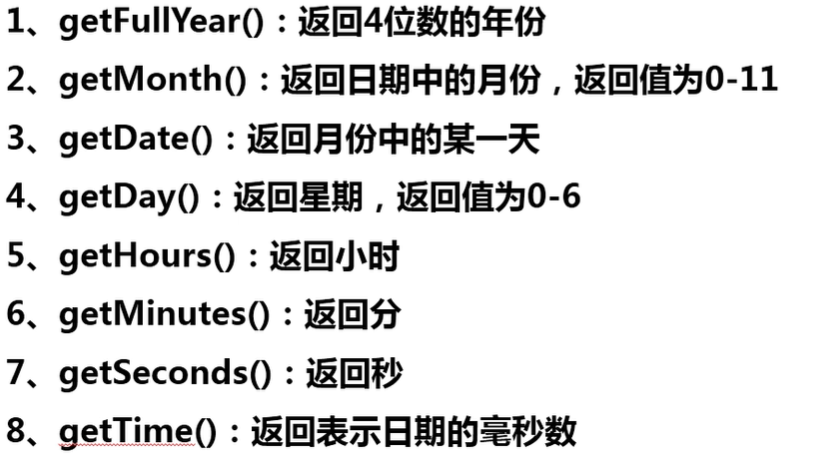

- *getTime()*  返回从1970年1月1日00点开始到现在时间的毫秒数
- 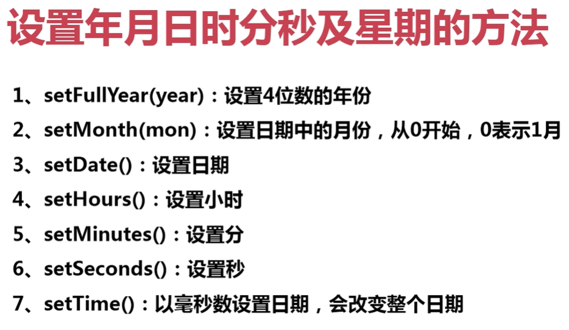

## 5.JavaScript错误处理

- Unexpected token， 语法错误

- ReferenceError，变量引用异常触发
- TypeError，类型使用错误是触发
- RangeError，不太常见，一般会在递归爆栈是触发，即递归深度太深

#### 5-1.如何区分语法错误与运行时错误

>一个简单的区分方法是：
>
>- 语法错误无论如何都不可能运行成功
>- 运行时错误是有可能运行成功的

#### 5-2.逻辑错误

>逻辑错误一般指的是计算结果不符合预期
>
>- 在代码中使用*debugger*关键字暂停
>- 直接在调试台中打断点， 在控制台行号点击

#### 5-3.主动触发错误

>当发生一些不可避免的错误时，可以使用下面的语句来抛出这个错误
>
>- throw语句     throw new Error ()   如果错误没有被try捕获到，那么就会发生错误的冒泡，一直往上级找try
>
>- ```javascript
> try { // 如果内部的代码抛出错误，则代码直接跳入catch块运行且把错误对象赋值给catch括号内的变量
>          // 捕获不到token 括号错误
>         var x = null;
>         console.log(x.foo)
>     } catch (e) { // 如果catch和finally中都有return，那么finally中的return生效
>         console.log('错误')
>     } finally {
>         // finally块的代码一定会执行
>         //  做一些请理性的工作
>     }
>   ```
> ```
>
>- 
> ```

## 6.DOM

### 6-1DOM基本概念：

1. DOM是JS操控HTML和CSS的桥梁

2. DOM简介：

   - DOM (Document Object Model),文档对象模型)是JavaScript操作HTML文档的接口，使文档操作变得非常优雅、简便。

3. DOM最大的特点就是将文档表示为节点树。DOM节点树【如图】

4. 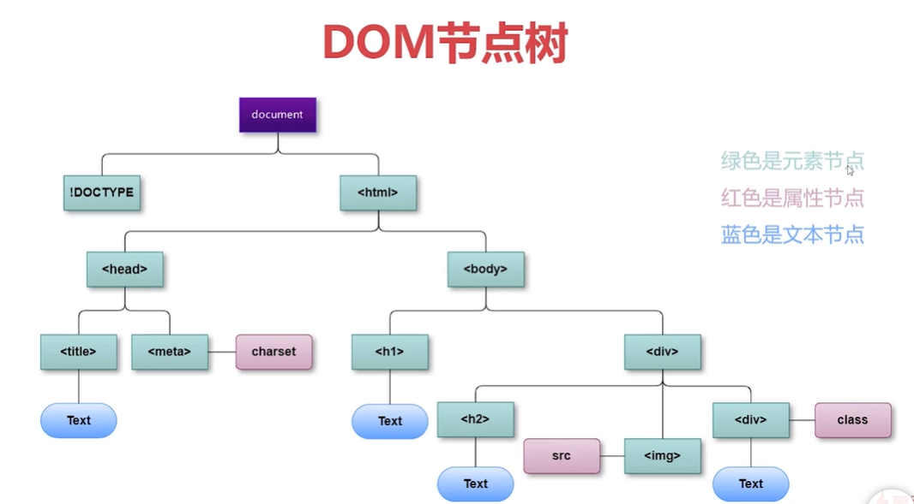

   

### 6-2.nodeType测试节点值

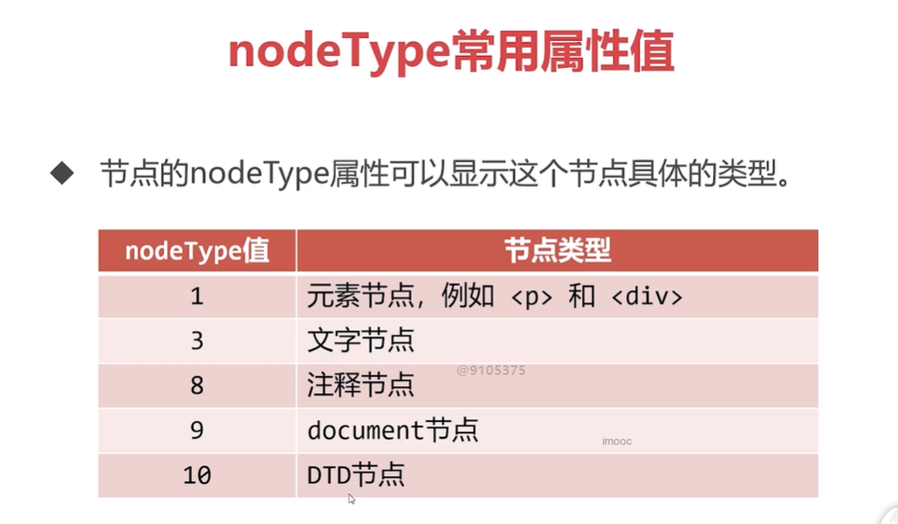

​					

### 6-3.访问元素节点

>- 所谓‘访问’元素节点，就是指‘得到’、‘获取’页面的元素节点
>- 对节点进行操作，第一步就是要得到它
>- 访问元素节点主要依靠document对象

#### 1.认识document对象

>- document对象是DOM中最重要的东西，几乎所有DOM的功能都封装在了document对象中
>- document对象也表示整个HTML文档，它是DOM节点树的根
>- document对象的nodeType属性值是9

#### 2.访问元素节点的常用方法

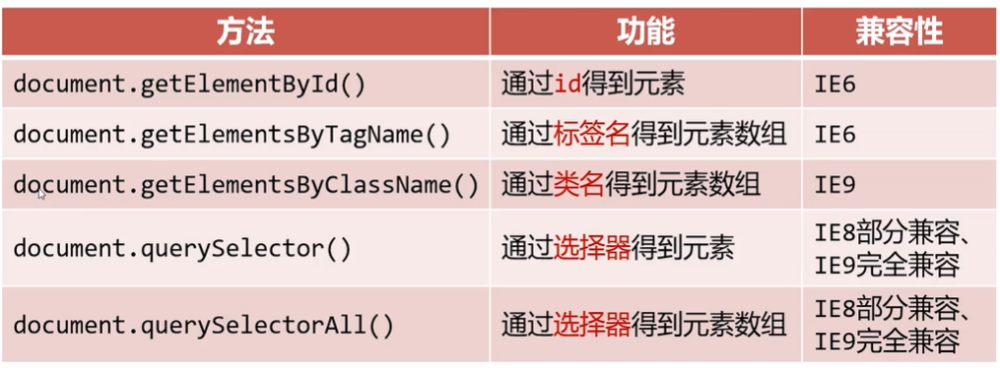

> 注意：如果页面上有多个相同的ID，则只能获取第一个
>
> querySelector方法只能获取一个元素，IE9开始支持CSS3选择器，并且只能由document发起

### 6-4.延迟运行

>- 在测试DOM代码时，*通常js代码一定要写在HTML节点后面*，否则JS无法找到相应HTML节点
>- 可以使用window.onload = function () {} ，使页面加载完毕后，再执行代码   就是给window对象添加事件监听

### 6-5.节点关系

>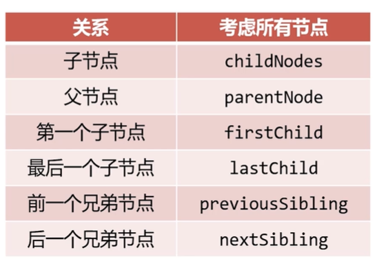
>
>*注意*： *文本节点也属于节点，在使用节点的关系时一定要注意*
>
>​			在标准的W3C规范中，空白文本节点也应该算作节点，但是					在IE8及以前的浏览器会有一定的兼容问题，他们不把空文本					节点当做节点
>
>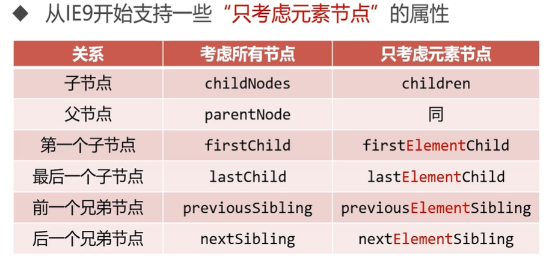

### 6-6.书写常见的节点关系函数

```javascript
    // 封装一个函数，这个函数可以返回元素的所有子节点（兼容到IE6），类似children的功能
    function getChildren(node) {
        // 结果数组
        var children = [];
        // 遍历node这个节点的所有子节点，判断每一个子节点的nodeType属性是不是1
        // 如果是1，就推入数组
        for (let i = 0; i < node.childNodes.length; i++) {
            if (node.childNodes[i].nodeType == 1) {
                children.push(node.childNodes[i])
            }
        }
        return children
    }


// 封装一个函数，这个函数可以返回元素的前一个兄弟节点（兼容到IE6），类似previousElementSibling的功能
    function getElementPrevSibling(node) {
        var o = node;
        // 使用while语句
        while (o.previousSibling != null) {
            if (o.previousSibling.nodeType == 1) {
                // 结束循环 找到了
                return o.previousSibling;
            }
            // 让o成为它的前一个节点
            o = o.previousSibling;
        }
        return null
    }


//  封装第三个函数，这个函数可以返回元素的所有兄弟节点
    function getAllElementSibling(node) {
        // 前面的兄弟节点
        var prevs = [];
        // 后面的元素兄弟节点
        var nexts = [];

        var o = node;
        // 遍历node的前面的节点
        while (o.previousSibling != null) {
            if (o.previousSibling.nodeType == 1) {
                prevs.unshift(o.previousSibling)
            }
            o = o.previousSibling;
        }
        // 遍历完成之后初始化 o
        o = node;
        // 遍历node的后面的节点
        while (o.nextSibling != null) {
            if (o.nextSibling.nodeType == 1) {
                nexts.push(o.nextSibling)
            }
            o = o.nextSibling;
        }

        // 将两个数组进行合并  并返回
        return prevs.concat(nexts)
    }
```

### 6-7.如何改变元素节点中的内容

>改变元素节点中的内容可以使用两个相关属性：
>
>此方法会覆盖原始内容
>
>- innerHTML    只能以*HTML语法*设置节点内容  
>- innerText    只能以纯文本的形式设置节点中的内容

### 6-8.如何改变元素节点的CSS样式

>element.style.驼峰样式属性 =  '样式属性值'
>
>设置的为行内样式， 权重1000
>
>```javascript
>	oDiv.innerText = '我爱你';
>    oDiv.style.width = '200px';
>    oDiv.style.height = '200px';
>    oDiv.style.backgroundColor = 'red'
>    document.body.style.margin = '0'
>```

### 6-9.如何改变元素节点的HTML属性

>标准的W3C属性，如src，href等等，只需要直接打点进行更改即可
>
>element.属性名= '属性值'
>
>```javascript
>element.src = 'images/1.jpg'
>```
>
>不符合W3C标准的属性(自定义属性)，要使用setAttribute()和getAttribute()来设置、读取
>
>```javascript
>element.setAttribute('data-index', '2')  // 设置属性
>element.getAttribute('data-index') // 获取属性值
>```

### 6-10.节点的创建、移除和克隆

>- 节点的创建
>
>- *document.caerteElement* ()方法用于创建一个指定tagName的HTML元素
>
>- 新创建出的节点是‘孤儿节点’，这意味着它并没有被挂在到DOM树上，我们无法看见它
>
>- 必须继续使用appendChild()或insertBefore()方法将孤儿节点插入到DOM树上
>
>- *appendChild()*   它可以将孤儿节点挂载到DOM节点的内部，成为它的最后一个子节点   
>
>- ```javascript
>  父节点.appendChild(孤儿节点)
>  ```
>
>
>
>- *insertBefore()* 它可以将孤儿节点挂载到DOM节点的内部，成为它的‘*标杆子节点*’之前的节点   
>
>- ```javascript
>  父节点.insertBefore(孤儿节点，标杆节点)
>  ```

>
>
>- 移动节点
>
>- 如果将已经挂载到DOM树上的节点成为appendChild()或insertBefore()的参数，这个节点将会被移动
>
>- ```javascript
>  新父节点.appendChild(已经有父亲的节点)
>  新父节点.insertBefore(已经有父亲的节点，标杆子节点)
>  ```
>- 这意味着一个节点不能同时位于DOM树的两个位置

>- 删除节点
>
>- removeChild() 方法从DOM中删除一个子节点
>
>- ```javascript
>  父节点.removeChild(要删除的子节点)
>  ```
>- 节点并不能主动删除自己，必须由父节点删除它

>- 克隆节点
>
>- cloneNode() 方法可以克隆节点，克隆出的节点是 ‘*孤儿节点*’
>
>- ```javascript
>  var 克隆孤儿节点 = 老节点.cloneNode();
>  ```
>- 参数是一个布尔值，表示*是否采用深度克隆*：如果为*true*，则该节点的所有后代节点也都会被克隆，如果为*false*，则只克隆该节点本身，*默认为false*

## 7.DOM事件基础

> JS和HTML之间的交互，就是通过事件来实现的
>
> 事件就是文档或浏览器窗口发生的一些特定的交互瞬间

### 7-1.HTML事件

> 直接在HTML元素标签内添加事件，执行脚本
>
> *this 在事件触发的函数中，this是对该DOM对象的引用*
>
> ```javascript
> <input type="button" value="弹出" onclick="fun(this)">
> function fun(btn) {
>     console.log(btn)   // input
> }
> ```

### 7-2.DOM0级事件

> 语法：ele.事件 = 执行脚本
>
> 功能： 在DOM对象上绑定事件
>
> 说明： 执行脚本可以是一个匿名函数，也可以是函数的引用(不加括					号)
>
> *只能给element绑定一次click事件，后绑定的事件会覆盖先绑定的事件*

### 7-3.鼠标事件

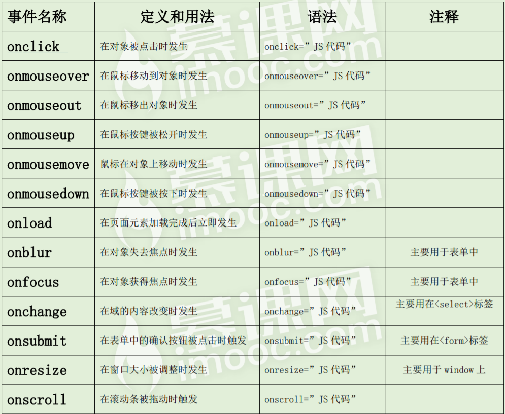

### 7-4.键盘事件

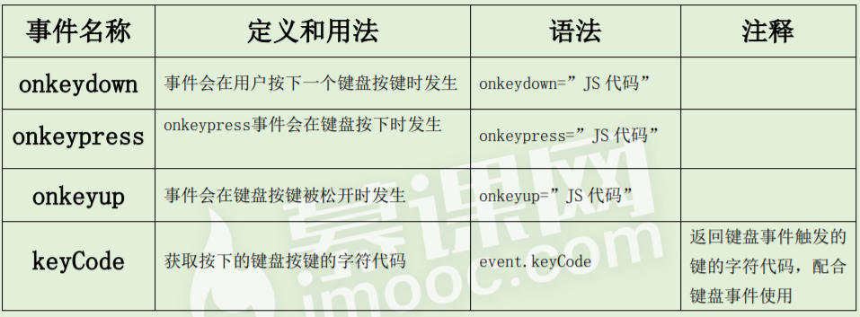

> 键盘事件触发顺序丛上到下
>
> onkeypress只会相应字母与数字符号     而且按下时会先触发事件，在输入文字

## 8.BOM

> BOM ( browser object model )   浏览器对象模型

### 8-1.window对象

> window是浏览器的一个实例，在浏览器中，window对象有双重	角色，它既是通过JavaScript访问浏览器窗口的一个接口，又是ECMAScript规定的一个*全局对象*
>
> 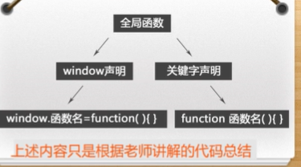
>
> *说明*：全局变量和全局方法都被归在window上
>
> - window.*alert* ('content') 
>
>   - 显示带有一段消息和一个确认按钮的警告框
>   - 字符串做返回值：alert（字符串）期望接受字符串，如果不是字符串，会强制转化为字符串再输出
>     当打印数组、对象、函数时，就会调用它们的toString()方法，将它们转为字符串形式输出
> - window.*confirm* ('message')
>
>   - 显示带有指定消息和OK及取消按钮的对话框
> - 点击确认返回true，点击取消返回false
>   - *使用\n换行*   通用
> - window.*prompt* ( text,defaulText )   弹出输入框
>   - text   要在对话框中显示的纯文本
>   - defaultText   默认的输入文本
>   - 点击取消返回null，确定返回输入的文本
> - window.*open* ( *pageURL*, *name*, *parameters*)   
>   - 打开一个新的浏览器窗口或查找一个已命名的窗口
>   - pageURL:子窗口路径
>   - name:子窗口句柄（name声明了新窗口的名称，方便后期通过name对子窗口进行引用）
>   - parameters：窗口参数（各参数用逗号分隔）
>     - 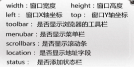
> - window.*close* ()     关闭当前窗口
> - window.*innerWidth*     返回浏览器窗口文档显示区的宽度
> - window.*innerHeight*    返回浏览器窗口文档显示区的高度

### 8-2.定时器      类似异步    this指向window

#### 1.setTimeout ( code, millisec)   超时调用

>*功能*： 在指定的毫秒数后调用函数或计算表达式
>
>*参数说明*： 
>
>- *code*  要调用的函数或要执行的JavaScript代码串
>- *millisec*   在执行代码前需等待的毫秒数
>
>返回值： ID值  Object  可以通过它来取消超时调用
>
>*clearTimeout* (ID值)    取消超时调用

#### 2.setInterval ( code, millisec)    间歇调用

>*功能*： 每隔指定的时间就执行一次代码
>
>*参数说明*： 
>
>- *code*  要调用的函数或要执行的JavaScript代码串
>- *millisec*   间隔的时间
>
>返回值： ID值   Object  可以通过它来取消间歇调用
>
>*clearInterval* (ID值)    取消间歇调用

### 8-3.location对象    操作URL

>location对象提供了与当前窗口中加载的文档有关的信息，还提供了一些导航的功能，它既是window对象的属性，也是document对象的属性。

>​		*location对象属性*
>
>1. *location.href*     返回当前加载页面的完整URL
>   - location.href与window.location.href等价、
>2. *location.hash*    返回hash值
>   - hash(#号后跟零或多个字符),如果不包含就返回空字符串
>3. *location.host*     返回服务器名称和端口号(如果有)    主机地址
>4. *location.hostname*     返回不带端口号的服务器名称
>5. *location.pathname*     返回URL中的目录和（或）文件名
>6. *location.port*     返回URl中指定的端口号，如果没有，返回空字符串
>7. *location.protocol*    返回页面使用的协议
>8. *location.search*    返回URL的查询字符串，这个字符串已问号开头
>
>
>
>​			*location对象方法*
>
>1. *location.href*      通过此方法修改浏览器地址会有历史记录
>2. *location.replace(URL)*    重新定向URL 不会有历史记录
>3. *location.reload()*   重新加载页面   有可能从缓存中加载 *location.reload(true)*    强制从服务器重新加载
>
>

### 8-4.history对象      保存访问页面的历史记录

>history  对象保存了用户在浏览器中访问页面的历史记录
>
>- *history.back()*    回到历史记录的上一步    并且刷新页面
>  - 相当于使用了*history.go(-1)*
>- *history.go()*   参数为负数时为后退，否则前进   
>  - 此方法不会刷新页面
>- *history.forward()*    回到历史记录的下一步   并且刷新页面
>  - 相当于使用了history.go(1)

### 8-5.Screen对象   包含有关客户端显示屏幕的信息

>- screen.*availWidth*      返回可用的屏幕宽度      任务栏除外
>- screen.*availHeight*       返回可用的屏幕高度   任务栏除外

### 8-5.Navigator对象    获取浏览器信息

>- navigator.UserAgent      
>
> - 用来识别浏览器名称、版本、引擎以及操作系统等信息
>
>- ```javascript
> function getBrowser() {
>         /*检测浏览器类型的函数*/
> 
>         // 获取userAgent属性   并将值转换为小写
>         var explorer = navigator.userAgent.toLowerCase();
>         var browser;
>         if (explorer.indexOf('msie') > -1) browser = 'IE';
>         else if (explorer.indexOf('chrome') > -1) browser = 'chrome';
>         else if (explorer.indexOf('opera') > -1) browser = 'opera';
>         else if (explorer.indexOf('safari') > -1) browser = 'safari';
>         return browser;
>     }
>   ```

## 9.js事件

### 9-1.事件绑定和移除

> 事件是可以被JavaScript侦测到的行为，通俗的讲就是当用户与Web页面进行交互时，解释器就会创建响应的event对象以描述事件信息
>
> *事件句柄*  ：事件句柄（又称事件处理函数、事件监听函数），指用于响应某个事件而调用的函数，每一个事件均对应一个事件句柄，在程序执行时，将相应的函数或语句指定给事件句柄，则在该事件发生时，扣篮器便执行指定的函数或语句
>
> ```javascript
> ele.addEventListener(事件，事件句柄，冒泡捕获)
> ```

>- 直接在HTML中定义元素的事件相关属性
>
>  - *缺点*：违反了“内容与行为相分离”的原则，不利于复用代码,应尽可能少用。
>
>- *DOM0级事件*     *兼容所有浏览器*
>
>  - *缺点*：此语法实现了“内容与行为相分离”，但元素只能绑定一个监听函数,以最后一个事件覆盖前面的事件
>
>- *DOM2级事件*           *注意浏览器兼容*     *IE9+*
>
>  - 高级事件处理方式，一个事件可以绑定多个监听函数，事件捕获和事件冒泡
>
>  - false:  冒泡        true   捕获
>
>  - ```javascript
>    btn.addEventListener("click", function(){},false); // DOM
>    btn.attachEvent("onclick", function(){});//IE
>    ```

>*事件移除方法*
>
>- *removeEventListener*()
>- element.removeEventListener(*event*,*function*,*useCaptrue*)
>- 功能：移除addEventListener()方法添加的事件句柄。
>- 参数：
>  - *event*：必须。字符串，要移除的事件名称。
>  - *function*：必须。指定要移除的函数的引用。
>  - *useCapture*：可选。布尔值，指定移除事件句柄的阶段。默认false
>- 事件解绑成功的主要原因在于保持addEventListener()和removeEventListener()的三个参数一模一样

>*IE事件流*（*IE事件处理程序*）  IE8及以下    *不支持捕获，默认是冒泡*
>
>- *attachEvent*(*event*,*function*)      添加事件       BOM2级
>  - 此方法里的匿名函数this指向window
>- *detachEvent*(*event*,*function*)     移除事件
>- *注意*    此方法事件类型前要加*on*
>
>

### 9-2.跨浏览器处理程序

```javascript
var EventUtil = {
        addHandler: function (element, type, handler) {
            /*兼容所有浏览器的DOM2级绑定事件*/
            // chrome、firefox、IE9+等    addEventListener
            // IE8及以下的浏览器      attachEvent
            if (element.addEventListener) {
                element.addEventListener(type, handler, false);
            } else if (element.attachEvent) {
                element.attachEvent('on' + type, handler);
            } else {
                element['on' + type] = null
            }
        },
        removeHandler: function (element, type, handler) {
            /*兼容所有浏览器的DOM2级移除事件*/
            // chrome、firefox、IE9+等    removeEventListener
            // IE8及以下的浏览器      detachEvent
            if (element.removeEventListener) {
                element.removeEventListener(type, handler, false);
            } else if (element.detachEvent) {
                element.detachEvent('on' + type, handler)
            } else {
                element['on' + type] = null
            }
        }
    }
```

### 9-3.事件周期     捕获和冒泡和委托     event对象

#### 1.捕获和冒泡

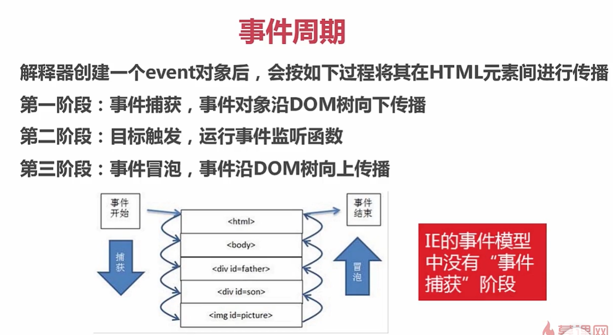

> *注意*：  *直系亲属的同类型事件才有捕获和冒泡*
>
> *捕获*：   从HTML开始往内层捕获，直到当前点击的元素     不常用
>
> *冒泡*：   从当前点击的元素开始向外冒泡     
>
> *W3C标准事件模型：先事件捕获从windows > document 往下级直到 特定的事件节点，然后进行事件处理，再事件冒泡* 

#### 2.事件委托

>事假委托就是通过事件冒泡机制将事件绑定在父元素上，然后在通过event对象判断点击的是哪一个子元素，然后运行相应的代码
>
>*使用事件委托可以提高性能*

#### 3.event对象常见属性和方法

>- *type*     事件的类型
>- *target*      触发事件的元素
>- *currentTarget*      绑定事件的元素
>- *preventDefault ()*     阻止默认行为   
>- *stopPropagation ()*    阻止事件冒泡或捕获
>- *clientY*       就是指浏览器顶部底边到鼠标的位置
>- *pageY*        就是指文档顶部到鼠标点击的位置
>- *screenY*       屏幕顶部到鼠标的位置，与浏览器无关
>- *button*   
>  - *0*   鼠标左键
>  - *1*    鼠标中间
>  - *2*    鼠标右键
>- *keyCode*      按下的键盘按键的键码
>- *charCode*     按下的按键的ASCII码
>
> IE8及以下浏览器的event对象的属性和方法
>
>- *type*     事件的类型
>- *srcElement*       触发事件的元素
>- *returnValue* *=* *false*     阻止默认行为  
>- *cancelBubble = true*     阻止事件冒泡或捕获
>- *button* 
>  - *0*    没有按下按钮
>  - *1*     按下主鼠标按钮
>  - *2*     按下次鼠标按钮
>  - *3*     同时按下主、次鼠标按钮
>  - *4*     按下鼠标中间
>
>event跨浏览器兼容
>
>```javascript
>var EventUtil = {
>       addHandler: function (element, type, handler) {
>           /*兼容所有浏览器的DOM2级绑定事件*/
>           // chrome、firefox、IE9+等    addEventListener
>           // IE8及以下的浏览器      attachEvent
>           if (element.addEventListener) {
>               element.addEventListener(type, handler, false);
>           } else if (element.attachEvent) {
>               element.attachEvent('on' + type, handler);
>           } else {
>               element['on' + type] = null
>           }
>       },
>       removeHandler: function (element, type, handler) {
>           /*兼容所有浏览器的DOM2级移除事件*/
>           // chrome、firefox、IE9+等    removeEventListener
>           // IE8及以下的浏览器      detachEvent
>           if (element.removeEventListener) {
>               element.removeEventListener(type, handler, false);
>           } else if (element.detachEvent) {
>               element.detachEvent('on' + type, handler)
>           } else {
>               element['on' + type] = null
>           }
>       },
>       getTarget: function (event) {
>           return event.target || event.srcElement;
>       },
>       preventDefault: function (event) {
>           if (event.preventDefault) {
>               event.preventDefault();
>           } else {
>               event.returnValue = false;
>           }
>       },
>       stopPropagation: function (event) {
>           if (event.stopPropagation) {
>               event.stopPropagation();
>           } else {
>               event.cancelBubble = true
>           }
>       }
>   }
>```

### 9-4.事件类型

#### 1.PC端常用事件

>- *load*     当页面全部加载完成时触发
>  - 可以实现图片预加载   
>  - 动态加载script标签    style标签
>- *resize*     窗口发生变化触发    此类事件非常耗性能
>- *scroll*      滚动时触发      此类事件非常耗性能
>- *search*     <input="search">输入文本时触发，其余文本域不支持
>- *blur*       元素失去焦点触发
>- *focus*      元素获取焦点是触发     *不支持冒泡*
>- *focusin*     同*focus*一样      *支持冒泡*
>- *focusout*     同*blur*一样
>- *click*      鼠标点击事件
>- *dblclick*      鼠标双击事件
>- *mousedown*     鼠标按下时触发的事件
>- *mouseup*      鼠标松开时触发事件     down+up = click
>- *mousemove*      鼠标在元素上移动时触发，注意性能优化
>- *mouseout*      鼠标离开元素或其子元素时触发
>- *mouseover*     鼠标进入元素或其子元素时触发
>- *mouseenter*     同*mouseover*一样   只能进入目标元素才触发
>- *mouseleave*    同*mouseout*一样  只能离开目标元素才触发
>- *keydown*     按下键盘按键时触发    支持所有按键 *keyCode*
>- *keyup*     松开键盘按键时触发     *keyCode*
>- *keypress*     按下字符键触发   使用*charCode*，*keyCode*不稳定
>- *textInput*     *text*输入框输入文本触发   *e.data*返回输入的值
>- *DOMNodeRemoved*   删除任意元素时触发
>- *DOMNodeInserted*   添加任意元素时被触发
>- *DOMSubtreeModified*    DOM结构中发生任何变化都会触发
>- *DOMNodeRemovedFromDocument*   从文档移除之前触发
>- *DOMNodeInsertedIntoDocument*    从文档添加之前被触发
>- H5新增
>- *DOMContentLoaded*    在DOM树之后就会触发，不理会图像、JavaScript文件、css文件或其他资源是否已经下载
>- *readystatechange*   提供文档或者元素加载过程
>    - 但是很难预料与load事件一起使用
>    - 1.document.readyState == uninitialized   尚未初始化
>    - 2.loading   对象正在加载数据
>    - 3.interactive    可以操作对象，但还没有完全加载
>    - 4.对象已经加载完毕
>    - *支持IE、firfox、opera*
>- *hashchange*     一定给window添加，URL#后面的值变化就会触发    
>    - *event.oldURL*       改动之前的地址
>    - *event.newURL*      改变之后的地址

#### 2.移动端常用事件类型

>- *touchstart*    手指触摸屏幕时触发
>- *touchmove*   手指在屏幕上滑动时触发   注意性能优化
>- *touchend*    手指从屏幕上移开时触发
>- *touchcancel*    当系统停止跟踪触摸时触发
>- event
>- *event.touches*    当前触摸屏幕的触摸点数组（记录触摸点的信息，有可能多个手指一起触摸）
>- *event.changedTouches*    数组中只包含引起事件的触摸点信息（如果有四个手指触摸在屏幕上只移动了2个，那只存储这两个移动的触摸点信息）
>- *event.targetTouches*   只包含放在元素上的触摸信息（在绑定事件的对象上的触摸点的信息）

## 10.切片

>GIF    用作动图，  背景透明的颜色单一的小图标
>
>JPEG    不能处理背景为透明的图片
>
>PNG8     色彩饱满
>
>PNG24    不能被IE低版本浏览器所支持
>
>*切图的优化*
>
>- 颜色代替图片
>- 雪碧图制作
>- 字体图标的使用
>
>*快捷键*
>
>- Delete   删除图层
>- Ctrl + E    合并图层
>- V    移动
>- C     裁切
>
>*切图辅助*
>
>- 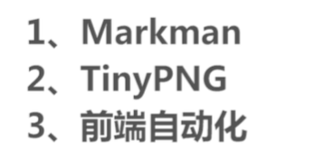

## 11.拓展知识

### 1.开发技巧

>1. 从大到小

### 2.BEM开发模式

> BEM代表块(block),  元素(element),    修饰符(modifier)  
>
> - 模块（没有前缀，多个单词用-连接
> - 元素（元素在模块之后，可以有多个层级， 以 __ 连接
> - 修饰 (某元素、或者某模块特别的状态，必须有一个状态名和状态值,使用 _ 连接

>背景图覆盖模式
>
>- background-size: cover;