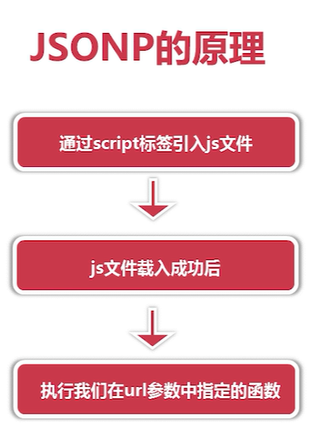
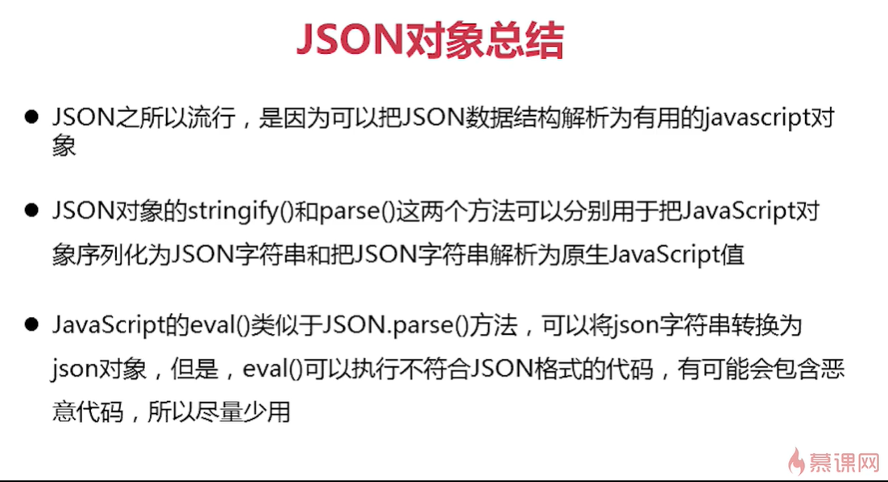

# 1.AJAX

## 1.什么是AJAX

>全称是 Asynchronous JavaScript and XML（即**异步**的 JavaScript 和 XML），它并不是一种新的编程语言，而是几种原有技术的结合体。Ajax 是一种在无需重新加载整个网页的情况下，能够更新部分网页的技术！

## 2.AJAX的优缺点

>*Ajax的优点:*
>
>1. 通过异步模式，提升了用户体验，异步操作不需要排队，同步需要排队
>2. 优化了浏览器和服务器之间的传输，减少不必要的数据往返，减少了带宽占用
>3. Ajax引擎在客户端运行，承担了一部分本来由服务器承担的工作，从而减少了大用户量下的服务器负载
>
>*Ajax的缺点*
>
>1. 不支持浏览器back回退按钮
>2. 安全问题   Ajax暴露了与服务器交互的细节
>3. 对搜索引擎的支持比较弱

## 3.XMLHttpRequest对象

>XMLHttpRequest是一种支持异步请求的技术，它是Ajax的核心
>
>*XMLHttpRequest的作用*
>
>- 可以向服务器提出请求并处理响应，而不阻塞用户，
>- 可以再页面加载以后进行页面的局部更新

## 4.如何使用Ajax？

>*使用 Ajax，实现完整一个 Ajax 的异步调用和局部刷新，有以下步骤*
>
>- 创建 XMLHttpRequest 的对象，也就是创建一个异步调用对象 ；
>- 创建一个新的 HTTP 请求并指定该 HTTP 请求的方法及URL ；
>- 设置响应 HTTP 请求状态变化的函数 ；

>1. 创建XMLHttpRequest对象
>2. 创建HTTP请求   
>   - **open(method,url,async)**   
>   - 创建HTTP请求，规定请求的类型，URL及是否异步处理请求
>   - **method**  请求类型 **get**或**post**     
>   -   **url**   文件在服务器上的位置
>     1. 是唯一一个必须要指定的参数，其它两个可选，用来设置服务器上文件的地址，该文件可以是任何类型的文件，如.txt和.xml,或者服务器脚本文件，如.asp和.php (在传回响应之前，能够在服务器上执行任务)
>   - **async**    **true**(**异步**)或**false**(**同步**)
>   - *注意：open方法不会向服务器发送真正的请求，它相当于初始化请求并准备发送只能向同一个域中使用相同协议和端口的URL发送请求，否则会因为安全原因报错*
>   - *GET*与*POST*的区别：
>   - 与POST相比，GET更简单也更快，并且在大部分情况下都能用，然而，在以下情况中，必须使用POST请求
>     - 无法使用缓存文件(更新服务器上的文件或数据库)
>     - 想服务器发送大量数据(POST是没有数据量限制)
>     - 发送包含位置字符的用户输入时，POST比GET更稳定也更可靠
>   - *同步与异步的区别*
>     - 同步：提交请求 -> 等待服务器处理 -> 处理完毕返回 这个期间不能干任何事
>     - 异步: 请求通过事件触发 -> 服务器处理(这个时候浏览器仍然可以做其他事情) -> 处理完毕
>   - *async*是一个布尔值，如果是异步通信方式(true)，客户机就不等待服务器的响应，如果是同步方式(false)，客户机就要等到服务器返回消息后才去执行其他操作
>3. 响应XMLHttpRequest对象状态变化的函数  onreadystatechange在readyState属性发生改变时触发
>4. 发送请求   **send()**

```javascript
// 封装xhr对象，兼容各个版本
    function createXHR() {
        // 判断浏览器是否将XMLHttpRequest作为本地对象实现，针对IE7，Firefox、Opera等
        if (typeof XMLHttpRequest != "undefined") {
            return new XMLHttpRequest();
        } else if (typeof ActiveXObject != 'undefined') {
            // 将所有可能出现的ActiveXObjext版本放在一个数组中
            var xhrarr = ['Microsoft.XMLHTTP','MSXML2.XMLHTTP.6.0','MSXML2.XMLHTTP.5.0','MSXML2.XMLHTTP.4.0','MSXML2.XMLHTTP.3.0','MSXML2.XMLHTTP.2.0'];
            // 遍历创建XMLHttpRequest对象
            let xhr;
            let len = xhrarr.length;
            for (let i = 0; i < len; i++) {
                const xhrarrElement = xhrarr[i];
                try {
                    // 创建XMLHttpRequest对象
                    xhr = new ActiveXObject(xhrarrElement);
                    break;
                } catch (e) {

                }
            }
            return xhr;
        } else {
            throw new Error('No XHR object')
        }
    }
    // 1.XMLHttpRequest对象
    var xhr = createXHR();
    var data = null;
    // 3.响应XMLHttpRequest对象状态变化的函数  onreadystatechange在readyState属性发生改变时触发
    xhr.onreadystatechange = function () {
        // 异步调用成功,响应内容解析完成,可以再客户端调用
        if (xhr.readyState === 4) {
            if (xhr.status >= 200 && xhr.status < 300 || xhr.status === 304) {
                // 获得服务器返回的数据
                // responseText从服务器进程返回数据的字符串形式
                // responseXML从服务器进程返回的DOM兼容的文档数据对象
                data = JSON.parse(xhr.responseText)
                console.log(data)
                // 将JSON格式的字符串转化为对象

            }
        }
    }
    // 2.创建请求
    // get请求参数直接写在URL后面 ?name=zhangsan&id=6  send中直接传入null
    // post请求参数放在send中，使用字符串形式，还需要设置下面这句话
    // xhr.setRequestHeader('Content-type','application/x-www-form-urlencoded')

    xhr.open('get','./server/slider.json',true);
    // xhr.setRequestHeader('Content-type','application/x-www-form-urlencoded')
    // 4.发送请求
    xhr.send(null);
```

```javascript
var $ = {
    ajax: function (options) {
        /*
        参数
        url 地址  必填 |
        method  传输方式，默认为get请求  |
        async  是否异步，默认为true异步  |
        data   请求的参数  |
        callback   ajax请求成功的回调函数  |
        error  ajax请求失败的回调函数  |
        */
        let xhr = null,  // XMLHTTPRequest对象
            url = options.url, // url 地址
            method = options.method || 'get',  // 传输方式，默认为get请求
            async = typeof (options.async) === 'undefined' ? true : options.async,   // 是否异步，默认为true异步
            data = options.data || null,  //请求的参数
            params = '',     // 转换为字符串形式的data
            callback = options.success,  // ajax请求成功的回调函数
            error = options.error;   // ajax请求失败的回调函数
        // 将data的对象字面量的形式转换为字符串形式
        if (data) {
            for (const dataKey in data) {
                params += dataKey + '=' + data[dataKey] + '&';
            }
            // params = params.substr(0,params.length-1);
            params = params.replace(/&$/, '');
            console.log(params)
        }

        // 根据method的值改变url
        if (method === 'get') {
            url += '?' + params;
        }
        // 创建XMLHttpRequest对象
        if (typeof XMLHttpRequest != 'undefined') {
            xhr = new XMLHttpRequest();
        } else if (typeof ActiveXObject != 'undefined') {
            let xhrarr = ['Microsoft.XMLHTTP', 'MSXML2.XMLHTTP.6.0', 'MSXML2.XMLHTTP.5.0', 'MSXML2.XMLHTTP.4.0', 'MSXML2.XMLHTTP.3.0', 'MSXML2.XMLHTTP.2.0'];
            // 遍历创建XMLHttpRequest对象
            let len = xhrarr.length;
            for (let i = 0; i < len; i++) {
                const xhrarrElement = xhrarr[i];
                try {
                    // 创建XMLHttpRequest对象
                    xhr = new ActiveXObject(xhrarrElement);
                    break;
                } catch (e) {

                }
            }
        } else {
            throw new Error('No XHR object')
        }
        // 响应XMLHttpRequest对象状态变化的函数  onreadystatechange在readyState属性发生改变时触发
        xhr.onreadystatechange = function () {
            if (xhr.readyState === 4) {
                if ((xhr.status >= 200 && xhr.status < 300) || xhr.status === 304) {
                    callback && callback(JSON.parse(xhr.responseText));
                } else {
                    error && error();
                }
            }
        }
        // 创建发送请求
        xhr.open(method, url, async);
        xhr.setRequestHeader('Content-type', 'application/x-www-form-urlencoded')
        xhr.send(params);
    }
}
```


## 2.jQuery的ajax方法

>- $.ajax()
>- $.get()
>- $.post()
>- $.getJson()

## 3.跨域

>*同源策略*
>
>所谓的同源是指：域名，协议，端口均相同
>
>*什么是跨域*
>
>跨域是指从一个域名的网页去请求另一个域名的资源，严格一点的定义是：只要协议，域名，端口有任何一个不同，就被当做是跨域
>
>*如何解决跨域*
>
>- 跨域资源共享(CORS)
>- 使用jsonp  (**常用**)
>- 修改document.domain
>- 使用window.name

>*JSONP*
>
>jsonp是jSON witn Padding (填充式json)  的简写，是应用JSON的一种新方法，也是一种跨域解决方案
>
>JSONP由两部分组成：回调函数和数据，回调函数是当响应到来时应该在页面中调用的函数，而数据就是传入回调函数中的JSON数据
>
>JSONP的原理：直接用XMLHttpRequest请求不同域上的数据时，是不可以的。但是，在页面上引入不同域上的js脚本文件却是可以的，jsonp正是利用这个特性来实现的。
>
>*利用可访问别的域名的属性  src*
>
>
>
>```javascript
>function getJSONP(url, callback) {
>        if (!url) {
>            return;
>        }
>        var a = ['a', 'b', 'c', 'd', 'e', 'f', 'g', 'h', 'i', 'j']; //定义一个数组以便产生随机函数名
>        var r1 = Math.floor(Math.random() * 10);
>        var r2 = Math.floor(Math.random() * 10);
>        var r3 = Math.floor(Math.random() * 10);
>        var name = 'getJSONP' + a[r1] + a[r2] + a[r3];
>        var cbname = 'getJSONP.' + name; //作为jsonp函数的属性
>        if (url.indexOf('?') === -1) {
>            url += '?jsonp=' + cbname;
>        } else {
>            url += '&jsonp=' + cbname;
>        }
>        var script = document.createElement('script');
>        //定义被脚本执行的回调函数
>        getJSONP[name] = function(e) {
>            try {
>                callback && callback(e);
>            } catch (e) {
>                //
>            } finally {
>                //最后删除该函数与script元素
>                delete getJSONP[name];
>                script.parentNode.removeChild(script);
>            }
>
>        }
>        script.src = url;
>        document.getElementsByTagName('head')[0].appendChild(script);
>    }
>    // 跨域调用
>    getJSONP('http://class.imooc.com/api/jsonp', function(response) {
>        console.log(response);
>    });
>```
>
>
>
>

# 4.JSON

>JSON（JavaScript object notation），全称为 JavaScript 对象表示法，
>它是一种数据交换的文本格式，而不是一种编程语言，用于读取结构化数据,2001年由Douglas Crockford提出，目的是取代繁琐笨重的 XML 格式 。

>JSON的语法可以表示一下三种类型的值:
>
>- 简单值
>  使用与 JavaScript 相同的语法，可以在 JSON 中表示字符串、数值、布尔值和null；
>  字符串【必须使用双引号表示】，不能使用单引号。
>  数值必须以【十进制】表示且【不能使用 NaN 和 Infinity 】；
>  JSON 【不支持】 JavaScript 中特殊值 【undefined 】；
>
>- ----------------------------------------------------------------------------------------------------
>
>- 对象
>  作为一种复杂数据类型，表示的是一组有序的键值对，而每个键值对中的值可以是简单值，也可以是复杂数据类型的值 ；
>  JSON 中对象的键名必须放在双引号里面，因为 JSON 不是JavaScript 语句，所以没有末尾的分号；
>  同一个对象中不应该出现两个同名属性；
>
>- -----------------------------------------------------------------------------------------------------
>
>- 数组
>  也是以一种复杂数据类型，表示一组有序的值的列表，可以通过数值索引来访问其中的值。
>  *注意：数组或对象最后一个成员的后面，不能加逗号 ；*

>JSON对象的两个方法
>
>- **parse(参数)     JSON.parse()**      用于将字符串转换为对象
>- **JSON.stringify(参数)**    用于将一个值转为字符串，该字符串应该符合JSON格式，并且可以被JSON.parse()方法还原

