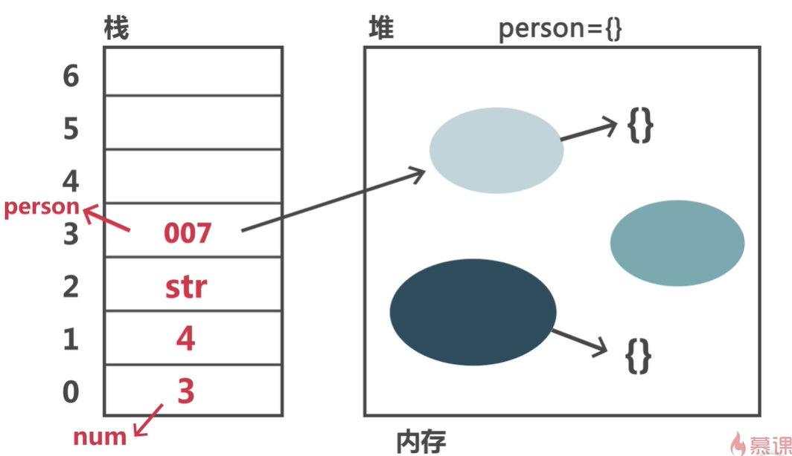
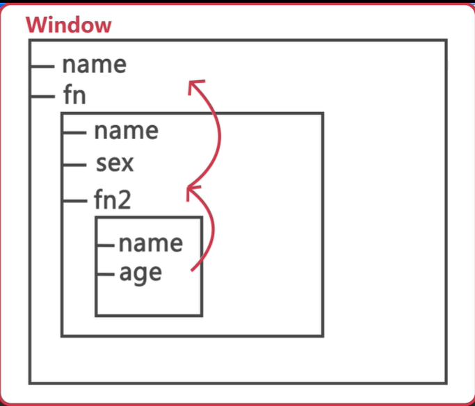
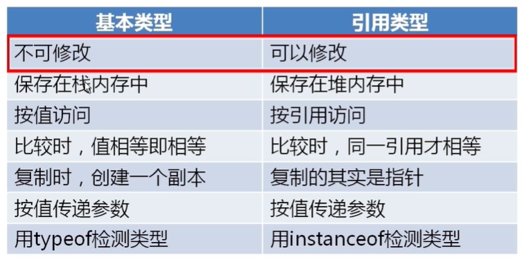
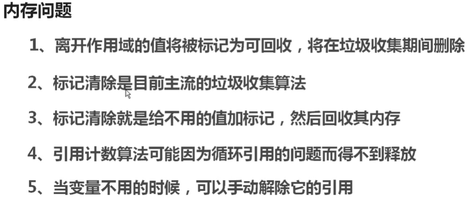
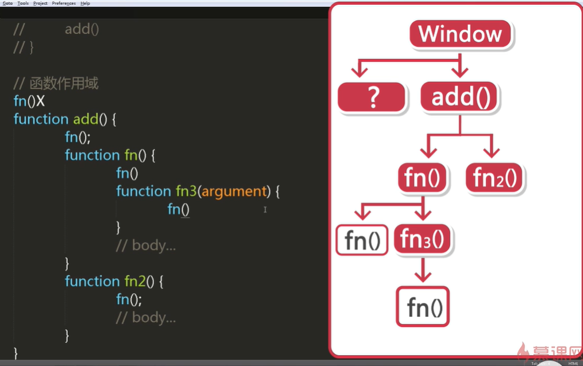

# JavaScript深入理解

## 1.变量、作用域和内存问题

### 1.变量

> - 基本类型：number  string   布尔值  undefined null
>
>   -  *基本类型只能覆盖原值，不能修改原本的值*
>   -  *基本类型的属性和方法都是从它们对应的包装对象上借的，本身是没有属性方法的*
>   -  *基本类型的值复制，只是单纯的复制，值互不干扰*
>
> - 引用类型：数组， 对象、function
>
>   -  *引用类型可以修改里面的值*
>   -  *引用类型比较时只有指向同一个地址才相等*
>
> - *函数传参都是按值传递*   引用类型的值为地址
>
> - *栈*      
>
>   -  基本类型保存在栈中   
>   -  引用类型的地址指针保存在栈中
>   -  栈是有序的，内存大小是固定的
>
> - *堆*      
>
>   - 引用类型大小是不固定的保存在堆内存中
>   - 堆内存大小是不固定的
>
>   
>
>   *当进行访问的时候，如果访问的是基本类型，那就直接返回栈内存中的数据【按值访问】；如果访问的是引用类型，就先从栈内存中取出引用地址，然后根据引用地址在堆内存中查询到最终的数据【按引用访问】。*
>
> - instanceof 运算符   只能用于引用类型
>
> - ```javascript
>   console.log([] instanceof Array)// true
>   ```

### 2.作用域

> *变量的作用域*    变量起作用的区域
>
> - 全局作用域
>   - 生命周期为所有脚本执行完成之后销毁
>   - 不用var声明的变量为全局变量
>   - *所有的全局变量和全局函数都是挂载在window对象下的*
>
> - 局部作用域
>   - 函数作用域
>   - 生命周期为当前函数执行完成之后销毁
> - 块级作用域   ES5没有块级作用域
>   - 一个花括号 {} 就叫做块级作用域 	
> - *注意*：直接输出未定义的变量名会报错，但是加上window的话则不会，只是会输出undefined
>
> *作用域链*
>
> - 
> - 局部的变量加载速度优于全局变量，优先级也高于全局
> - 作用域链可以延长： with(person)， 这个括号内部其实就是将with这个区块的变量对象设置为person对象， 这样里面不用‘.’就能够访问person对象的属性。而如果访问的变量不是person的属性，则一样会顺着作用域链到外层找。 尽量不要用

### 3.js解析机制

> JS预解析
>
> - **在当前作用域中，JavaScript代码执行之前，浏览器首先会默认的把所有带var和function声明的变量进行提前的声明或者定义。**
> - **函数的参数会在函数内部进行预解析，参数相当于var声明**
> - 预解析是按照script块来解析的，每个script都是毫不相干的
>
> - 预解析完之后在逐行解析代码
> - 预解析时如果变量名冲突（重复），后面的变量名会覆盖前面的
> - 预解析时如果变量名和函数名冲突，函数名会覆盖掉变量名
> - 预解析时如果函数名和函数名冲突，谁在后面的时候保留谁
> - if或者for里面定义函数，在老版本浏览器中会不能预解析，造成错误，所以不推荐在if或者for里面定义函数。
>
> 逐行解读代码

### 4.内存管理和垃圾回收机制

>垃圾回收机制 ：释放无用的数据，回收内存
>
>- 自动回收   JavaScript
>- 手动回收     Objective-C
>- 原理： 找出没用的数据，打上标记，释放其内存；周期性执行
>- 标识无用数据的策略
> - 标记清除
>   - 环境中的变量
> - 引用计数   *不常用*
>   - IE6 7 8 里面采用的还是 “引用计数策略“
>   - 在IE6 7 8 中DOM和BOM不是JS原生对象，会被当做引用类型
>   - 可以重新将引用赋值为null来减少计数，让它变为0
>
>内存管理
>
>- Web浏览器 < 桌面应用程序
>- 优化内存最佳方式，只保存内存中有用的数据，没用的立即将它释放掉，释放的最佳方法就是给它赋值为null，这个做法叫做解除引用，适用于大多的全局变量，局部变量在离开作用域的时候回自动被赋值为null，

### 5.变量和作用域总结





## 2.函数

>对象：
>
>- 访问没有的属性值不会报错，会返回undefined
>- 'name' in obj        查找这个obj是否有name这个属性
>- **枚举**(遍历)对象时不可以使用.的方式，会返回undefined，只能使用[]中括号

### 1.什么是函数

>- 什么是函数？
>
> - 一次封装(定义)，四处使用(调用)
> - 用function定义命名函数
> - 用构造函数定义    new Function('num1','num2')
> - 没有名字的函数就是匿名函数
> - 函数调用之后会销毁局部作用域和局部变量，但是函数不会被销毁
>
>- 为什么要使用函数
>
> - 可以多次复用代码
> - 方便统一修改和维护
> - 增加可读性
>
>- 函数的二象性
>
> - 调用
> - 函数也是对象     也可以为它添加属性和方法

### 2.函数的定义

>- 字面量定义
>
>  - ```javascript
>    function add() {}   add()
>    ```
>
>- var 赋值表达式    
>
>  - ```javascript
>    var add = function () {}     add()
>    ```
>
>- 构造函数定义
>
>  - ```java
>    var fn = new Function('num1','num2','return num1 + num2;');
>    ```
>
>  - 参数和代码必须使用引号包起来
>
>- 以上三种定义方式的区别
>
>    - 字面量定义方式相比构造函数。直观简洁、方便书写
>    - 构造函数运行效率较慢一些
>    - 只有function定义的函数有预解析，会提升到当前函数所在作用域的顶部，其他两种是没有预解析的，不会提升；
>    - 构造函数定义函数不常用
>
>- 函数定义的位置
>
>    - 全局作用域
>     - 函数作用域     可以访问同一级和上一级
>     - if/for代码块中定义   因为没有块级作用域，所以使用function定义的函数会在全局作用域预解析   最好不要在if/for中定义函数
>     - 对象中定义函数
>   - 

### 3.函数的调用

> 普通函数
>
> - ***命名函数***
>
>   - 函数名()
>
> - *匿名函数*
>
>   - 赋值给变量，使用变量名()调用
>
>   - 赋值给变量然后立即执行
>
>     - ```javascript
>       var add= function () {
>               alert(456)
>           }()
>       ```
>
>   - 加上括号立即执行    也可以加上!+-~
>
>     - ```javascript
>       (function () {
>            alert(123)
>        })();
>       !+-~function () {
>               console.log(123)
>           }();
>       ```
>
> 
>
> 特殊函数的调用(方法的调用)
>
> - *对象里的方法*
>
>   - ```javascript
>     var operation = {
>       add:function (num1,num2) {
>           return num1 + num2;
>       },
>       subtract: function (num1,num2) {
>           return num2 - num1;
>       },
>       '@':function () {
>           console.log('a')
>       }
>     }
>     operation.add();
>     operation["@"]();
>     var key = 'add';
>     operation[key]();
>     ```
>
>     
>
>   - 对象里的属性，何时加引号何时不加
>     合法的标识符加不加引号都可以
>     不合法的标识符要加引号['@']，否则会报错
>     非法标识符调用时，只能用对象['非法标识符']
>
>   - 当调用对象的属性为变量时，必须使用[]，不能使用点
>
> - *事件函数调用*
>
>   - ```javascript
>     document.onclick = function () {
>         alert('点击了')
>     } // 点击之后浏览器自己调用
>     document.onclick(); // 模拟点击调用事件
>     ```
>
> - *方法的链式调用*
>
>   - 让函数里面的返回值为对象本身，就可以实现链式编程
>
>   - ```javascript
>     var operation = {
>         add:function (num1,num2) {
>             console.log(num1 + num2);
>             return this
>         },
>         subtract: function (num1,num2) {
>             console.log(num1 - num2);
>             return this
>         },
>         '@':function () {
>             console.log('a')
>         }
>     }
>     operation.add(1,2).subtract(2,1);
>     ```
>
> - *构造函数的调用*
>
>   - 构造函数必须通过new实例化调用
>   - 实例化构造函数返回值为一个对象
>
> - *函数的间歇调用*    **改变this指向**
>
>   - 每一个函数都有**call**()和**apply**()方法
>
>   - call()    第一个参数为this指向  传参方式为跟在this用逗号隔开一个一个传
>
>     - ```javascript
>       fn.call(this,1,2,3)
>       ```
>
>     - 
>
>   - apply()  第一个参数为this指向  传参方式为一个数组
>
>     - ```javascript
>       fn.apply(this,[1,2,3])
>       ```

### 4.参数的使用

>- 参数的类型
> - 形参     可以当做为var声明的局部变量   形参的个数arguments.length
> - 实参     传递的本质     var   形参 = 实参值；实参的个数**函数名**.length
>- 参数个数
> - 实参个数 = 形参个数
> - 实参个数  <  形参个数      其余形参会被赋值为undefined
> - 实参个数  >  形参个数     多传的无效
>- 参数可以传什么类型
> - 基本数据类型和复杂数据类型都可以
>- 要保证函数的纯洁性，**一个函数最好只做一件事**

### 5.arguments

>- 每一个函数都有arguments
>
>- arguments是一个**类数组**，不能使用**Array**的方法
>
>- ```javascript
>   { // 类数组
>   '0':1,
>   '1':2,
>   length: 2
>    }
>   ```
> 
>- 每一个arguments都是独有的，不能够跨函数访问
>
>- arguments.**callee**属性指向函数本身    严格模式下禁用此属性

### 6.return   函数返回值

>- return    函数结束  ， 将值返回， return后面的语句将不会执行
>- 只要是数据都可以作为返回值
>- 如果没有返回值，默认返回undefined

## 3.面向对象

>- 对代码的一种抽象，对外统一提供调用接口的编程的思想 ， **一切事物皆对象**
>- 基于原型的面向对象方式中，对象(Object)则是依靠**构造器(constructor)**利用**原型(prototype)**构造出来的
>- js*面向对象的名词解释*
>  - 属性： 事物的特性    事物自身拥有的东西
>   - 方法：事物的功能    事物的功能，比如人可以睡觉
>   - 对象： 事物的一个实例   
>   - 原型：Js函数中由prototype属性引用了一个对象，即原型对象(原型)
>   - fn.prototype -->  内存地址  -->  存储一个对象
>- Object是Javascript中一个父对象，JS中所有的自定义函数或面向对象都继承于object
>- *注意*： 通过**new**创建的对象效率比较低     通过**new**创建的对象为*函数对象*， 其余的都是**普通对象**

### 1.闭包

> 闭包是一个拥有许多变量和绑定了这些变量的环境表达式(通常是一个函数)
>
> - 特点   函数b是在a内嵌套的，函数a需要返回函数b
>
> - ```javascript
>   function a() {
>           var i = 0;
>           function b() {
>               console.log(i);
>           }
>           return b;
>       }
>       var c = a();
>       c()  // 0
>   ```
>
> - 用途
>
>   - 读取函数内部的变量
>   - 让 i 变量的值保留在内存中
>
> - 闭包的优缺点
>
>   - 优点：有利于封装，可以访问局部变量
>   - 缺点：内存占用浪费严重，内存泄漏

### 2.对象

>构造函数创建对象和工厂模式的区别
>
>- 构造方式不会显示创建对象，它将属性赋值给this，不需要return对象，构造函数不会显示创建对象，意思是可以直接使用new构造函数，创建对象，不需要new Object等方式
>- 工厂模式，在方法内部new Object对象，retrun Object对象，属性和方法都是赋给Object，调用时不需要new
>
>Js*中原型模式声明对象*
>
>- 任何js方法或函数，都自带一个prototype属性，且它以对象的方式存在
>- 原型模式根本：函数本身声明为空内容，利用prototype定义一些属性及方法
>- 优点：让所有实例化的对象都拥有它包含的属性及方法

### 3.封装

>把对象内部数据和操作细节进行隐藏
>
>Js通过闭包来进行封装

### 4.原型和原型链

>- 原型：是利用prototype添加属性和方法的
>
>- **js中所有的函数都有一个prototype属性**，该属性引用了一个对象，即原型对象，也简称原型。
>
>- js对象有一个__proto__属性，指向它的构造函数的prototype属性
>
>- *原型链的最终指向null*
>
>- **父元素的方法都会继承给子元素，不止是使用原型定义的**。
>
>- 原型链：JS在创建对象（不论是普通对象还是函数对象）的时候，都有一个叫做__proto__的内置属性,用于指向创建它的函数对象的原型对象prototype
>
>- ```javascript
> var p = new person(); // 三个阶段
> // 1  var p = {}   创建对象
> // 2  p.__proto__ = person.prototype
> // 3  创建对象(初始化对象) p --> person.call(p)
> ```
> ```
>
> ```
>
>```
>​```javascript
>var person = function () {
>
>}
>person.prototype.say = function () {
>alert('天气挺好')
>}
>var p = new person();
>p.say(); // p 没有say方法的
>// p.__proto__ = person.prototype  ---> 有say方法
>// p.__proto__.__proto__... 会一直找下去，这就是原型链
>
>
>var person = function () {
>
>}
>person.prototype.say = function () {
>    alert('天气挺好')
>}
>person.prototype.gongzi = 500;
>var programmer = function () {
>
>}
>programmer.prototype = new person();
>programmer.prototype.wcd = function () {
>    alert('明天天气也不错')
>};
>
>programmer.prototype.gongzi = 1000;
>
>var p = new programmer();
>// p.say()  可以调用
>// p.wcd()
>console.log(p.gongzi)
>
>// var p = new programmer();  p.__proto__ = programmer.prototype = new person();
>// p.say(); p.__proto__ --> programmer.prototype==new person --> new person.__proto__ = person.prototype.say()
>```
>
>
>// 原型链实现过程
>
>- *注意*    如果子类和父类有同名的属性和方法，那么子类会覆盖父类
>```
>
>```

### 5.构造函数继承

>```javascript
>// 构造函数继承
>function Parents(name) {
>   this.name = name;
>   this.say = function () {
>       console.log(this.name)
>   }
>}
>function Child(name,age) { // 继承Parents
>   this.pObj = Parents;// 子对象的参数name传递到父对象中
>   this.pObj(name);
>   this.age = age;
>   this.sayC = function () {
>       console.log(this.name)
>   }
>}
>var p = new Parents('zhangsan')
>p.say() // zhangsan
>var c = new Child('baba',18)
>c.sayC()  // baba
>
>// baba ---> this.pObj(name); ---> parents(name) ---> this.name = name='baba'
>// this.sayC ---> this.ame ---> parents --> this.name
>// 父对象 被子对象继承   所有属性和方法，都将传递到子对象中
>```
>
>使用call和apply方法实现继承
>
>```javascript
>// 使用call和apply方法实现继承
>function Person(name,age,len) {
>   this.name = name;
>   this.age = age;
>   this.len = len;
>   this.say = function () {
>       console.log(this.name,this.age,this.len)
>       console.log(this)
>   }
>}
>function student(name,age) {
>   Person.call(this,name,age)
>}
>function teacher(name,age,len) {
>   Person.apply(this,[name,age,len])
>}
>var person = new Person('zhangsan',25,'170')
>person.say()
>var stu = new student('lisi',18)
>stu.say()
>var tea = new teacher('wangwu',20,'180')
>tea.say()
>```
>
>

### 6.Js面向对象的关键词

>- instanceof     
>
> - arr instanceof Object    arr是否属于Object  返回布尔值
>
>- delete     
>
> - 删除对象的属性和方法   delete obj.say();   delete obj.name;
>
> - 注意：**不能删除原型链中的属性和方法**
>
>- call       
>
> - 第一个参数为this指向，如果函数中没有this指向，name第一个参数无用，传参为一个一个传
>
>- apply       
>
> - 第一个参数为this指向，如果函数中没有this指向，name第一个参数无用，传参为一个数组
>
>- arguments
>
> - 每个函数都有一个arguments对象的实例，引用函数的参数(实参)，可以用数组的下标方式引用arguments元素
>
> - **arguments.length** 参数个数
>
>- callee       是一个属性
>
> - 返回正在执行的function对象   arguments.callee指函数本身
>
>- **this**
>
> - ```javascript
>   // this 可以再函数内部定义属性/变量
>       /*
>       function test() {
>           this.x = 1; // this全局变量 --> x=1
>           console.log(this.x)
>       }
>       test()
>        */
>   
>       /*
>       var x = 1;
>       function test() {
>           this.x = 0 // 改变了全局变量 x 值
>       }
>       test()
>       console.log(x)
>        */
>   
>       //作为方法调用 --> 构造函数内 this指向当前对象
>       /*
>       function test() {
>           this.name = 'zhangsan'; // this表示当前对象  实例化对象 t
>           this.age = 18;
>       }
>       var t = new test()
>       console.log(t.name)
>        */
>   
>       // 在call apply   this第一个参数
>       var x = 0;
>       function test() {
>           console.log(this.x)
>       }
>       var o = {
>       };
>       o.x = 1;
>       o.m = test
>       // o.m.apply(); // 0  如果没有参数，那么指向函数本身所在的位置
>       // o.m();  // 1
>       // o.m.apply(o); // 1
>   ```
>
> - 

### 7.对象冒充

>将父类的属性和方法一起传给子类作为特权属性和特权方法
>
>```javascript
>// 对象冒充
>function Person(name,age) {
>   // 函数内部的这些叫做特权属性和特权方法
>   this.name = name;
>   this.age = age;
>   this.sayHi = function() {
>       console.log('hi')
>   }
>}
>Person.prototype.walk = function () {
>   console.log('walk....');
>}
>function student(name,age,grade) {
>   this.newMethod = Person;  // 冒充Person对象，传递特权属性和特权方法给子类
>   this.newMethod(name,age);
>   this.grade = grade;
>}
>var s1 = new student('zhangsan',15,5); // s1是student对象，继承Person，拥有Person所有属性和方法
>console.log(s1.name)
>console.log(s1.age)
>console.log(s1.grade)
>s1.sayHi()
>// s1.walk() // 报错
>// 注意 s1继承了 Person中的特权方法属性，没有继承共有方法
>```

## 4.正则表达式

>- 正则表达式的模式匹配：用模式匹配字符串,正则表达式都是操作字符串的
>
>- *说明*：该模式描述在查找文字主体时待匹配的一个或多个字符串，正则表达式作为一个模板，将某个字符模式与所搜索的字符串进行匹配
>
>- 查找，替换，数据有效性验证
>
>- **因为正则中的普通字符有：字母、数字、下划线(_)、汉字、空格以及其他一些没有特殊含义的字符(!@,;等)。而”.”在正则中具有特殊含义，表示匹配任意字符**
>
>   - *test* ()： pattern.test(str)   pattern为正则，传入的参数为字符串，在字符串中查找匹配正则的字符串，返回值为布尔值
>   - *exec*()： pattern.exec(str)--- 同上，返回的结果是以数组的形式（将匹配到的字符串放入到数组中返回）。若未匹配到，返回null;
>   - */js/img*      /后面是正则修饰符     *new RegExp ('js','i')*  第二个参数为修饰
>    - **// i ignoreCase**   忽略大小写
>      **// g global**  全局匹配    匹配所有的  匹配字符串所有能匹配上的
>      **// m multiline**  匹配多行   
>

### 1.转义字符

>
>- 字母可以转换为ASCLL码值    \x码值
>
>- **注意**      构造函数创建正则，那么里面的转义需要双重转义\\  
>
>    - **\n**   **\x0A** 匹配换行
>
>    - **\t**    **\u0009** 匹配Tab键
>
>    - **\u4e00-\u9fa5**    匹配所有汉字
>
>    - **[]**       匹配 *[javascript]* 里面的一个字符，先找到谁就是谁  
>
>    - **[^js]**       匹配除了**j**和**s**的第一个字符   ^取反
>
>    - **a-z**      匹配26个英文字母
>
>    - 只有在**[]**中才能匹配范围      且只能匹配一个字符
>
>    - **/./**     匹配除了**\n**换行符之外的所有字符
>
>    - **/\w/**     匹配 **[a-zA-Z0-9_]**      大写的W取反
>
>    - **/\d/**      匹配**[0-9]**       大写的D取反
>
>    - **/\s/**       匹配空格和Tab制表符或者unicode空白符   大写S取反
>
>    - **/{3}/**      匹配两个
>
>    - **/{1,2}/**    匹配最少一个，最多两个   ，逗号后面不能加空格
>
>    - **/{1,}/**     匹配大于等于一个
>
>    - **/\d+/**      表示/\d{1,}/，至少1次
>
>    - **/\d?/**      表示/\d{0,1}/， 0次或1次
>
>    - **/\d*/**      表示/\d{0,}/， 0次或多次
>
>    - 贪婪匹配：只和量词量（+、*、？等）有关，正则在默认的情况下都是贪婪的，只要条件允许，它都会尽可能多的去匹配。
>
>    - 在量词后面加？变为非贪婪匹配：尽可能少【不代表就只能匹配一个或零个，】   ， 正则会去字符串寻找第一个可能匹配的位置
>
>    - **贪婪与非贪婪的概念只有当你使用量词的时候才有意义。**
>
>    - **|**     或的意思  字符串中先找到谁就是谁
>
>    - **()**      可以用括号将匹配字符归为一组，还会自动捕获一次括号，先忽略括号运行一次，然后再自动捕获一遍括号内容，按顺序排列
>
>    - **(?:字符)**      非捕获，数组只会输出一个元素
>
>- - ```javascript
>        var str='ab cd ab'
>        var pattern = /(ab) cd \1/   // 这里的\1代表第一个分组
>        console.log(pattern.exec(str))  //  [ "ab cd ab", "ab" ]
>        ```
>
> 
>    - **注意**   只有捕获的时候才可以使用\1\2
>    - **/^js/**       匹配js开头的字符串     首匹配
>    - **/js$/**       匹配js结尾的字符串   尾匹配
>    - **/\b/**        匹配单词的边界      
>    - **/java(?=script)/**     前瞻性匹配  只有java后面跟的时script的时候才返回Java  
>    - **/java(?!script)/**     负向前瞻性匹配，只有Java后面跟的不是script的时候才返回Java
> 

### 2.RegExp()对象

>
>    - 构造函数方式，规则可以使用变量传进去，是可变的
>    - 转义字符需要双重转义    \\\     返回\的话，要
>    -  实例方法
>    - g 全局匹配（会匹配字符串所有能匹配上的）
>       pattern.lastIndex属性，初始为0，普通模式时是一直为0，开启全局匹配模式后，指向匹配到的字符的下一个位置，当全部匹配完后，会重新变为0
>    - **toString()**     将正则表达式转换为字符串
>    - **valueOf()**      返回正则表达式本身
>    - **exec()**     无论是否全局匹配都会返回分组中匹配到的内容，都只会返回当前匹配到的一个内容，而不是全部返回
>    - **test()**      在字符串中查找匹配正则的字符串，返回值为布尔值
>
>- *RegExp()*    实例属性
>
>   - **ignoreCase**     判断是不是有 i 这个修饰符    布尔值
>   - **global**       判断是不是有 g 这个修饰符    布尔值
>   - **multiline **     判断是不是有 m 这个修饰符    布尔值
>   - **source**      返回//里面的字符串    String
>   - **lastIndex**      初始为0，普通模式时是一直为0，开启全局匹配模式后，指向匹配到的字符的下一个位置，当全部匹配完后，会重新变为0
>
>- *RegExp*()     构造函数属性
>
>   - **input**  **$_**   返回要匹配的字符串
>   - **lastMatch**    **$&**  这个要用[]访问    最近一次匹配到的字符
>   - **leftContext**     **$`** 匹配到的字符在字符串中左边的字符串
>   - **rightContext**    **$'**  匹配到的字符在字符串中右边的字符串
>   - **lastParen**  **$+** 上一次匹配到的子选项，就是分组()捕获到的内容
>   - **$1 -  \$9 **      返回分组捕获到的内容
>
>- *String对象中与正则表达式相关的方法*
>
>   - **str.search(pattern)**    用正则到str中去找相对应的字符，找到了返回索引，没找到返回-1    有没有g不影响
>
>   - **str.match(pattern)**      非全局的情况下才会返回分组中匹配到的内容，和**exec()**相似，全局匹配只能匹配到所有匹配到的字符，
>
>   - **str.replace()**      $1指正则中的第一个分组  \$0指当前找到的字符
>
>   - **str.valueOf()**     返回正则本身
>
>       - ```javascript
>           // 1
>           var str = 'I love js';
>               str.replace(/(js)/, '<strong style="color: red">$1</strong>')
>           //  2 
>           var str = '中国军队和阿扁一起办证';
>               var pattern = /国军|阿扁|办证/g;
>               console.log(str.replace(pattern, function ($0,) {
>                   // console.log($0)
>                   var result = '';
>                   for (let i = 0; i < $0.length; i++) {
>                       result += '*';
>                   }
>                   return result;
>               }))
>           ```
>

## 5.表单验证

>数据有效性验证的俩个途径
>
>- Html4的时期，通过js脚本验证表单元素
>- Html5中，有些表单控件自带了一些验证属性