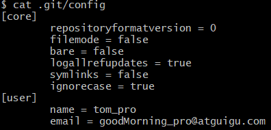

# Git

## 1.基本概念和工作原理

### 1-1.git结构

本地库    历史版本
 			 ↑
		*git cimmit*
 			 ↑

暂存区		临时存储

​	  ↑
​		*git add*
​			  ↑
​		工作区		写代码

### 1-2.Git和代码托管中心

> 代码托管中心的任务：维护远程库

- 局域网环境下
  - GitLab 服务器
- 外网情况下
  - GitHub
  - Gitee码云

### 1-3.本地库和远程库

- 团队内部协作
  - 
- 跨团队协作
  - 

## 2.Git命令行操作

### 2-1.本地库初始化

- 命令：git init
- 效果：
  - 
- 注意：.git 目录中存放的是本地库相关的子目录和文件，不要删除，也不要胡乱修改。

### 2-2.设置签名

- 形式
  - 用户名：tom
  - Email地址：goodMorning@atguigu.com
- 作用： 区分不同开发人员的身份。
- 辨析：这里设置的签名和登录远程库（代码托管中心）的账号密码没有任何关系
- 命令
  - 项目级别/仓库级别：仅在当前本地库范围内生效
    - git *config*  user.name tom_pro
    - git *config*  user.email goodMorning_pro@atguigu.com
    - 信息保存位置：./.git/config
  - 系统用户级别：登录当前操作系统用户的级别
    - git config *--global*  user.name tom_glb
    - git config *--global*  user.email goodMorning_glb@atguigu.com
    - 信息保存位置：~/.gitconfig文件
  - 级别优先级
    - 就近原则：项目级别优先于系统用户级别，二者都有时采用项目级别的签名
    - 如果只有系统用户级别的签名，就以系统用户级别的签名为准
    - 注意：二者都没有不允许

